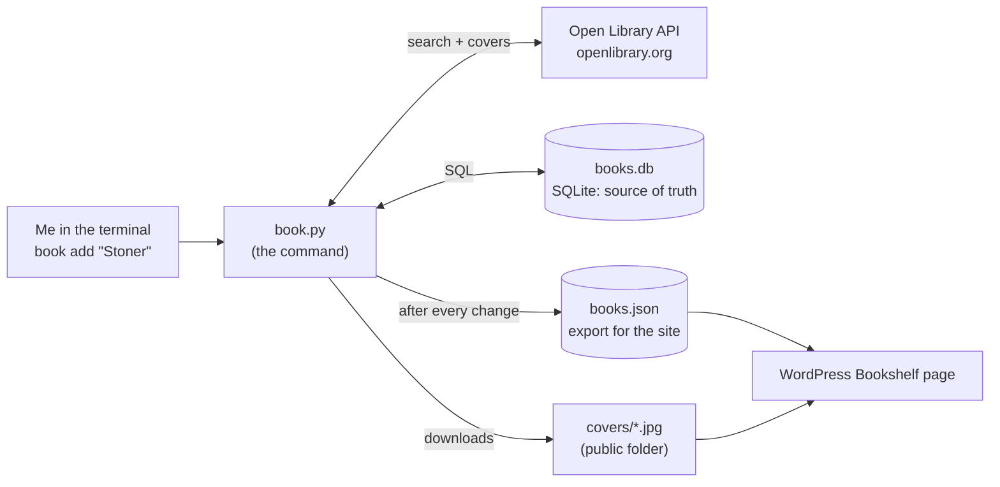

# Bookshelf Backend: Build It By Hand

**Date:** October 3, 2026
**Goal:** a `book` command on my Raspberry Pi that logs what I'm reading, and a data file the website can turn into a Goodreads-style Bookshelf page.
**Language:** Python 3 (standard library only, nothing to install) + SQLite + the Open Library API
**Time:** one or two evenings, in 8 phases. Each phase ends with a ✅ checkpoint you can test.

When I'm done, I'll be able to type:

```bash
book add "Stoner"                  # searches Open Library, I pick the right edition
book progress "Stoner" 120         # I'm on page 120
book finish "Stoner" --rating 5    # finished today, 5 stars
book want "Blindsight"             # to-read pile
book list                          # see my shelves
```

> Every code block in this guide was run and tested on my Pi before writing it down. If something breaks, compare my file with the block character by character. Indentation matters in Python.

---

## 0. The Architecture

It's the same **producer → file → website** pattern as the [[Home Lab Monitor - How the Website Shows My Pi Status|Home Lab monitor]]:



Why these pieces:

| Piece | Why |
|---|---|
| **SQLite** (`books.db`) | A real SQL database stored in one file. No server to run, built into Python. I already know SQL from work, so I can query my reading history like any table. |
| **Open Library API** | Free book database (run by the Internet Archive). I type a title, it gives me author, year, page count and a cover. No account or API key. |
| **`books.json`** | WordPress's PHP on my Pi can't read SQLite (no driver installed), but every language reads JSON. Exporting a JSON file after each change keeps the website simple and read-only. |
| **Covers on disk** | Downloaded once into the website's public uploads folder, so the page loads fast and doesn't depend on Open Library being up. |

The project is split into **5 small files**, each with one job:

| File | Job |
|---|---|
| `config.py` | Paths and settings in one place |
| `db.py` | The database: table design + queries |
| `openlibrary.py` | Talking to the Open Library API |
| `export.py` | Writing `books.json` for the website |
| `book.py` | The command itself: parses what I type and calls the others |

This is called **separation of concerns**: if Open Library changes their API, I only touch `openlibrary.py`; if I move folders, I only touch `config.py`.

---

## Phase 1: Set Up the Project Folder

```bash
mkdir -p /mnt/ssd/webpage/bookshelf
cd /mnt/ssd/webpage/bookshelf
```

Why here: `/mnt/ssd/webpage` is my website repo (so the code gets version-controlled with git), but **outside** `html/`, the public folder. My database and JSON export stay private; only the covers go in the public folder.

Tell git not to track the generated export (it's rebuilt from the database anyway):

```bash
printf '\n# Bookshelf export (regenerated by the book command)\nbookshelf/books.json\nbookshelf/books.json.tmp\nbookshelf/__pycache__/\n' >> /mnt/ssd/webpage/.gitignore
```

Optional but handy: install the SQLite command-line tool so I can look inside the database directly:

```bash
sudo apt install -y sqlite3
```

✅ **Checkpoint:** `pwd` prints `/mnt/ssd/webpage/bookshelf`.

---

## Phase 2: Settings (`config.py`)

Create `config.py`:

```python
"""Where everything lives. The only file you need to edit to move things around."""
from pathlib import Path

BASE = Path(__file__).resolve().parent              # /mnt/ssd/webpage/bookshelf
DB_PATH = BASE / "books.db"                         # source of truth (private)
EXPORT_PATH = BASE / "books.json"                   # what the website reads (private)
COVERS_DIR = BASE.parent / "html/wp-content/uploads/bookshelf/covers"  # public images
COVERS_URL = "/wp-content/uploads/bookshelf/covers"
USER_AGENT = "manuel-elizaldi.com bookshelf (personal project)"
```

What's going on:
- `Path(__file__).resolve().parent` = "the folder this file is in", resolved through any symlinks. Using it instead of hard-coding `/mnt/ssd/webpage/bookshelf` means the project still works if I move or rename the folder.
- `BASE.parent / "html/..."`: `pathlib` lets me build paths with `/`, which reads naturally and works on any operating system.
- `COVERS_URL` is how the **browser** will reach the covers (a web address), while `COVERS_DIR` is where the **Pi** stores them (a disk path). Same files, two different names. That distinction comes up all the time in web work.
- `USER_AGENT`: when my program calls someone's API, it introduces itself. Open Library asks for this so they can contact heavy users instead of blocking them.

✅ **Checkpoint:**
```bash
python3 -c "import config; print(config.DB_PATH); print(config.COVERS_DIR)"
```
prints `/mnt/ssd/webpage/bookshelf/books.db` and `/mnt/ssd/webpage/html/wp-content/uploads/bookshelf/covers`.

---

## Phase 3: The Database (`db.py`)

### 3.1 Designing the table

Before writing code, decide **what one book looks like**. Every book is one row:

| Column | Type | Example | Notes |
|---|---|---|---|
| `id` | INTEGER PRIMARY KEY | 1 | SQLite numbers rows automatically |
| `ol_key` | TEXT UNIQUE | `/works/OL3511459W` | Open Library's id. UNIQUE stops duplicates |
| `title`, `author` | TEXT | Stoner, John Williams | |
| `year`, `pages` | INTEGER | 1965, 293 | |
| `cover_file` | TEXT | `OL3511459W.jpg` | Just the file name, not the full path |
| `status` | TEXT | `reading` | Only `want`, `reading` or `read` allowed |
| `current_page` | INTEGER | 120 | For the progress bar |
| `started`, `finished` | TEXT | `2026-10-03` | Dates as ISO text |
| `rating` | INTEGER | 5 | Only 1–5 allowed |
| `review` | TEXT | "Quiet and devastating." | Optional |
| `added` | TEXT | `2026-10-03` | Filled in automatically |

Design decisions worth understanding:
- **One table with a `status` column** instead of three tables (reading / want / read). A book *moves* between shelves; with one table that's just `UPDATE ... SET status = 'read'`. With three tables I'd have to copy the row and delete the original.
- **Dates as ISO text (`YYYY-MM-DD`)**: SQLite has no real date type, but ISO dates sort correctly as text (`2026-09-01` < `2026-10-03`) and SQLite's date functions understand them.
- **`CHECK` constraints** make the database itself refuse bad data. Even if my Python has a bug, it can never store `status = 'raed'` or `rating = 7`. Rules enforced as close to the data as possible are the most reliable.

### 3.2 The code

Create `db.py`:

```python
"""Everything that touches the SQLite database."""
import sqlite3
from config import DB_PATH

SCHEMA = """
CREATE TABLE IF NOT EXISTS books (
    id            INTEGER PRIMARY KEY,
    ol_key        TEXT UNIQUE,                 -- Open Library work id, e.g. /works/OL16804836W
    title         TEXT NOT NULL,
    author        TEXT,
    year          INTEGER,                     -- first published
    pages         INTEGER,
    cover_file    TEXT,                        -- e.g. OL16804836W.jpg (in COVERS_DIR)
    status        TEXT NOT NULL CHECK (status IN ('want', 'reading', 'read')),
    current_page  INTEGER DEFAULT 0,
    started       TEXT,                        -- ISO dates: 2026-10-03
    finished      TEXT,
    rating        INTEGER CHECK (rating BETWEEN 1 AND 5),
    review        TEXT,
    added         TEXT NOT NULL DEFAULT (date('now', 'localtime'))
);
"""


def connect():
    conn = sqlite3.connect(DB_PATH)
    conn.row_factory = sqlite3.Row    # rows behave like dicts: row["title"]
    conn.executescript(SCHEMA)        # creates the table the first time, no-op after
    return conn


def find(conn, title):
    """Books whose title contains the text (case-insensitive)."""
    return conn.execute(
        "SELECT * FROM books WHERE title LIKE ? ORDER BY added DESC", (f"%{title}%",)
    ).fetchall()
```

What's going on:
- `CREATE TABLE IF NOT EXISTS` runs on every connect. The first time it creates the table; after that it does nothing. So there's no separate "install" step: the database creates itself.
- `row_factory = sqlite3.Row` lets me write `row["title"]` instead of remembering that title is column number 2.
- `DEFAULT (date('now', 'localtime'))` fills in `added` automatically with today's date in my time zone.
- In `find()`, the `?` is a **placeholder**. SQLite inserts the value safely. **Never** build SQL by pasting text into a string like `f"... LIKE '%{title}%'"`: a title containing a quote (`Ender's Game`) would break the query, and in a web app that same mistake is how SQL injection attacks work.

✅ **Checkpoint:**
```bash
python3 -c "import db; c = db.connect(); print(c.execute('SELECT COUNT(*) FROM books').fetchone()[0])"
```
prints `0`, and a `books.db` file now exists (`ls -l`).

---

## Phase 4: Talking to Open Library (`openlibrary.py`)

### 4.1 Explore the API by hand first

Before writing code for any API, poke it from the terminal to see what comes back:

```bash
curl -s "https://openlibrary.org/search.json?q=stoner&limit=2&fields=key,title,author_name,first_publish_year,number_of_pages_median,cover_i" | python3 -m json.tool
```

I get something like:

```json
{
    "numFound": 17,
    "docs": [
        {
            "author_name": ["John Williams"],
            "cover_i": 8310729,
            "first_publish_year": 1965,
            "key": "/works/OL3511459W",
            "number_of_pages_median": 293,
            "title": "Stoner"
        },
        ...
    ]
}
```

Things I learn from looking:
- Results are in a list called `docs`.
- `author_name` is a **list** (books can have several authors).
- Some fields can be **missing** (a book with no cover has no `cover_i`), so my code must not assume they exist.
- `fields=` asks for only the fields I need, so the response is small and fast.

Covers have their own URL pattern, built from `cover_i`. Open this in a browser:
`https://covers.openlibrary.org/b/id/8310729-M.jpg` (`S`, `M`, `L` = small, medium, large).

### 4.2 The code

Create `openlibrary.py`:

```python
"""Talking to the Open Library API (free, no account): search books, download covers."""
import json
import urllib.parse
import urllib.request
from config import USER_AGENT

SEARCH_URL = "https://openlibrary.org/search.json"
COVER_URL = "https://covers.openlibrary.org/b/id/{cover_id}-M.jpg"   # M = ~180px wide


def _get(url):
    req = urllib.request.Request(url, headers={"User-Agent": USER_AGENT})
    with urllib.request.urlopen(req, timeout=10) as res:
        return res.read()


def search(title, limit=5):
    params = urllib.parse.urlencode({
        "q": title,
        "limit": limit,
        "fields": "key,title,author_name,first_publish_year,number_of_pages_median,cover_i",
    })
    data = json.loads(_get(f"{SEARCH_URL}?{params}"))
    return [
        {
            "ol_key": doc["key"],
            "title": doc.get("title", "?"),
            "author": ", ".join(list(dict.fromkeys(doc.get("author_name", [])))[:2]) or None,
            "year": doc.get("first_publish_year"),
            "pages": doc.get("number_of_pages_median"),
            "cover_id": doc.get("cover_i"),
        }
        for doc in data.get("docs", [])
    ]


def download_cover(cover_id, dest):
    dest.parent.mkdir(parents=True, exist_ok=True)
    dest.write_bytes(_get(COVER_URL.format(cover_id=cover_id)))
```

What's going on:
- `_get()` starts with an underscore: Python's convention for "internal helper, not meant to be used from other files".
- `urllib.parse.urlencode()` builds the `?q=...&limit=...` part and **escapes** special characters. A title like `Of Mice & Men` would otherwise break the URL, because `&` separates parameters.
- `timeout=10`: never call the network without a timeout, or a slow server can freeze my program forever.
- `doc.get("title", "?")` instead of `doc["title"]`: `.get()` returns a default instead of crashing when a field is missing.
- `list(dict.fromkeys(...))` removes duplicate names while keeping their order. Open Library sometimes lists the same author twice ("Peter Watts, Peter Watts"); I found this while testing.
- The list comprehension turns Open Library's format into **my** format (`ol_key`, `title`, `author`...). The rest of my program never sees Open Library's field names, so if they rename something, only this file changes.

✅ **Checkpoint:**
```bash
python3 -c "import openlibrary; [print(b) for b in openlibrary.search('the pearl steinbeck', 2)]"
```
prints two dictionaries, the first being *The Pearl* by John Steinbeck, 1945.

---

## Phase 5: The Export for the Website (`export.py`)

Create `export.py`:

```python
"""Write books.json for the website (same safe-write trick as the Home Lab collector)."""
import json
import os
from datetime import datetime
from config import EXPORT_PATH, COVERS_URL


def export(conn):
    def book(row):
        b = dict(row)
        b["cover_url"] = f"{COVERS_URL}/{b['cover_file']}" if b["cover_file"] else None
        return b

    rows = conn.execute("SELECT * FROM books").fetchall()
    data = {
        "generated_at": datetime.now().isoformat(timespec="seconds"),
        "reading": [book(r) for r in rows if r["status"] == "reading"],
        "want": [book(r) for r in rows if r["status"] == "want"],
        "read": sorted((book(r) for r in rows if r["status"] == "read"),
                       key=lambda b: b["finished"] or "", reverse=True),
    }
    tmp = EXPORT_PATH.with_suffix(".json.tmp")
    tmp.write_text(json.dumps(data, indent=1, ensure_ascii=False))
    os.chmod(tmp, 0o644)
    tmp.replace(EXPORT_PATH)
```

What's going on:
- The website needs data grouped by shelf, with the newest finished books first, so the export does that work once here instead of in PHP on every page view.
- `cover_url` turns the stored file name into a web address the browser can load.
- `ensure_ascii=False` keeps accented titles readable (`Fjallsárlón`, `Cien años de soledad`) instead of `á` escapes.
- The last four lines are the **atomic write** from the Home Lab note: write to `.tmp`, set permissions to readable-by-all (Apache runs as a different user, `www-data`), then rename over the real file in one step. The website can never read a half-written file.

✅ **Checkpoint:**
```bash
python3 -c "import db, export; export.export(db.connect())" && cat books.json
```
prints a JSON file with empty `reading`, `want` and `read` lists.

---

## Phase 6: The Command Itself (`book.py`)

Create `book.py`:

```python
#!/usr/bin/env python3
"""book: log what I'm reading.

  book add "Stoner"                 start reading (searches Open Library)
  book want "Blindsight"            add to Want to Read
  book progress "Stoner" 120        I'm on page 120
  book finish "Stoner" --rating 5   finished today
  book list                         show my shelves
"""
import argparse
import sys
from datetime import date

import db
import openlibrary
from config import COVERS_DIR
from export import export


def pick(results):
    """Show search results and let me choose one."""
    for i, r in enumerate(results, 1):
        print(f"  {i}. {r['title']} | {r['author'] or 'unknown'} | {r['year'] or '?'} | {r['pages'] or '?'} pages")
    choice = input("Which one? [1] (0 to cancel): ").strip() or "1"
    if not choice.isdigit() or not 0 < int(choice) <= len(results):
        sys.exit("Cancelled.")
    return results[int(choice) - 1]


def one_book(conn, title):
    """Find exactly one book already on my shelves by (part of) its title."""
    matches = db.find(conn, title)
    if not matches:
        sys.exit(f'No book matching "{title}" on your shelves. Add it with: book add "{title}"')
    if len(matches) > 1:
        names = ", ".join(m["title"] for m in matches)
        sys.exit(f'"{title}" matches several books ({names}). Use more of the title.')
    return matches[0]


def cmd_add(conn, args, status):
    results = openlibrary.search(args.title)
    if not results:
        sys.exit(f'Open Library found nothing for "{args.title}".')
    b = pick(results)
    cover_file = None
    if b["cover_id"]:
        cover_file = b["ol_key"].split("/")[-1] + ".jpg"
        openlibrary.download_cover(b["cover_id"], COVERS_DIR / cover_file)
    conn.execute(
        """INSERT INTO books (ol_key, title, author, year, pages, cover_file, status, started)
           VALUES (?, ?, ?, ?, ?, ?, ?, ?)
           ON CONFLICT (ol_key) DO UPDATE SET status = excluded.status, started = excluded.started""",
        (b["ol_key"], b["title"], b["author"], b["year"], b["pages"], cover_file, status,
         date.today().isoformat() if status == "reading" else None),
    )
    shelf = "Currently Reading" if status == "reading" else "Want to Read"
    print(f'Added "{b["title"]}" to {shelf}.')


def cmd_progress(conn, args):
    b = one_book(conn, args.title)
    conn.execute("UPDATE books SET current_page = ?, status = 'reading', started = COALESCE(started, ?) WHERE id = ?",
                 (args.page, date.today().isoformat(), b["id"]))
    total = f" of {b['pages']}" if b["pages"] else ""
    print(f'"{b["title"]}": page {args.page}{total}.')


def cmd_finish(conn, args):
    b = one_book(conn, args.title)
    conn.execute(
        "UPDATE books SET status = 'read', finished = ?, rating = ?, review = COALESCE(?, review), current_page = pages WHERE id = ?",
        (args.date or date.today().isoformat(), args.rating, args.review, b["id"]),
    )
    stars = "★" * (args.rating or 0)
    print(f'Finished "{b["title"]}" {stars}')


def cmd_list(conn, args):
    for status, label in (("reading", "CURRENTLY READING"), ("want", "WANT TO READ"), ("read", "READ")):
        rows = conn.execute("SELECT * FROM books WHERE status = ? ORDER BY COALESCE(finished, added) DESC", (status,)).fetchall()
        print(f"\n{label} ({len(rows)})")
        for r in rows:
            extra = {"reading": f"page {r['current_page']}/{r['pages'] or '?'}",
                     "want": f"added {r['added']}",
                     "read": f"{r['finished']} {'★' * (r['rating'] or 0)}"}[status]
            print(f"  - {r['title']} ({r['author'] or '?'}) · {extra}")


def main():
    parser = argparse.ArgumentParser(prog="book", description="Log what I'm reading.")
    sub = parser.add_subparsers(dest="command", required=True)
    sub.add_parser("add", help="start reading a book").add_argument("title")
    sub.add_parser("want", help="add to Want to Read").add_argument("title")
    p = sub.add_parser("progress", help="update the page I'm on")
    p.add_argument("title")
    p.add_argument("page", type=int)
    f = sub.add_parser("finish", help="mark a book as read")
    f.add_argument("title")
    f.add_argument("--rating", type=int, choices=range(1, 6))
    f.add_argument("--review")
    f.add_argument("--date", help="YYYY-MM-DD, defaults to today")
    sub.add_parser("list", help="show my shelves")
    args = parser.parse_args()

    conn = db.connect()
    with conn:   # commit if everything worked, roll back on any error
        if args.command == "add":
            cmd_add(conn, args, "reading")
        elif args.command == "want":
            cmd_add(conn, args, "want")
        elif args.command == "progress":
            cmd_progress(conn, args)
        elif args.command == "finish":
            cmd_finish(conn, args)
        elif args.command == "list":
            cmd_list(conn, args)
            return
        export(conn)


if __name__ == "__main__":
    main()
```

What's going on, top to bottom:
- **`#!/usr/bin/env python3`** (the "shebang") tells Linux which program runs this file, so I can run `./book.py` instead of `python3 book.py`.
- **The docstring** at the top doubles as documentation for future me.
- **`pick()`** shows the top 5 search matches. Searching "Stoner" also finds a management textbook by an author named Stoner, so I always confirm which book I mean. Pressing Enter picks #1.
- **`one_book()`** handles the opposite direction: finding a book *already on my shelves* from part of its title (`book finish stoner`). If nothing or several books match, it stops with a helpful message instead of guessing.
- **`sys.exit("message")`** prints the message and stops the program with an error status. Good for "you asked for something impossible".
- **`cmd_add()`** handles both `add` and `want` (they only differ in the shelf). Its SQL uses an **upsert**:
  ```sql
  INSERT INTO books (...) VALUES (...)
  ON CONFLICT (ol_key) DO UPDATE SET status = excluded.status, started = excluded.started
  ```
  "Insert this book; if it's already there (same `ol_key`), just update its shelf." So `book want "Blindsight"` today and `book add "Blindsight"` next month moves it from Want to Read to Currently Reading instead of creating a duplicate. `excluded` means "the values I tried to insert".
- **`COALESCE(a, b)`** returns the first value that isn't empty. `started = COALESCE(started, today)` keeps the original start date if there is one.
- **`argparse` subcommands** turn `book finish "Stoner" --rating 5` into `args.command == "finish"`, `args.title == "Stoner"`, `args.rating == 5`. It also generates `--help` for free and rejects bad input: `choices=range(1, 6)` means `--rating 7` is refused before my code even runs.
- **`with conn:`** wraps everything in a **transaction**: if all goes well, changes are saved (committed); if anything crashes halfway, nothing is saved (rolled back). The database never ends up half-updated.
- **`export(conn)`** runs after every change, so `books.json` is always current. `list` returns early because it doesn't change anything.

Make it runnable:

```bash
chmod +x book.py
./book.py --help
```

✅ **Checkpoint:** `--help` shows the 5 commands.

---

## Phase 7: Try It and Make It a Real Command

### 7.1 First real books

```bash
./book.py add "Stoner"
./book.py progress stoner 120
./book.py finish stoner --rating 5 --date 2026-09-01
./book.py want "Blindsight"
./book.py list
```

Expected `list` output:

```
CURRENTLY READING (0)

WANT TO READ (1)
  - Blindsight (Peter Watts) · added 2026-10-03

READ (1)
  - Stoner (John Williams) · 2026-09-01 ★★★★★
```

Check the cover downloaded: `ls -l /mnt/ssd/webpage/html/wp-content/uploads/bookshelf/covers/`, then open `https://manuel-elizaldi.com/wp-content/uploads/bookshelf/covers/OL3511459W.jpg` in a browser. It's public on my site now.

Test the safety nets too:

```bash
./book.py progress "nothing like this" 3     # helpful "No book matching" message
./book.py finish stoner --rating 7           # refused by argparse
```

### 7.2 Type `book` from anywhere

Right now I have to be in the folder and type `./book.py`. To make it a real command, put a **symlink** (a shortcut) in a folder that's on my `PATH`:

```bash
ln -s /mnt/ssd/webpage/bookshelf/book.py ~/.local/bin/book
cd ~ && book list
```

How this works: when I type a command, the shell searches each folder listed in `$PATH` (`echo $PATH`) for a file with that name. `~/.local/bin` is already on my PATH. The symlink named `book` points to my script, and because the shebang says `python3`, Linux runs it with Python. `config.py` uses `.resolve()`, which follows the symlink back to the real folder, so the script still finds `books.db`.

✅ **Checkpoint:** `book list` works from my home folder.

---

## Phase 8: Ask My Reading History Questions with SQL

This is where SQLite pays off. Open the database:

```bash
sqlite3 /mnt/ssd/webpage/bookshelf/books.db
```

Then try (type `.headers on` and `.mode column` first for nicer output; `.quit` to exit):

```sql
-- Books and pages read per year
SELECT strftime('%Y', finished) AS year, COUNT(*) AS books, SUM(pages) AS pages
FROM books WHERE status = 'read' GROUP BY year ORDER BY year DESC;

-- My average rating per author
SELECT author, COUNT(*) AS books, ROUND(AVG(rating), 1) AS avg_rating
FROM books WHERE status = 'read' GROUP BY author ORDER BY books DESC;

-- How long each book took me
SELECT title, julianday(finished) - julianday(started) AS days
FROM books WHERE finished IS NOT NULL AND started IS NOT NULL ORDER BY days;

-- Fix a typo by hand (the CHECK constraints still protect me)
UPDATE books SET review = 'Quiet and devastating.' WHERE title = 'Stoner';
```

After editing by hand, regenerate the website file: `book list` doesn't export, so run
`python3 -c "import db, export; export.export(db.connect())"` from the project folder (or make any `book` change).

---

## Next: Connecting It to the Website

The backend is done when `books.json` and the covers exist. The website side works exactly like the Home Lab monitor:

1. A page template in my theme (`html/wp-content/themes/elizaldi98/page-bookshelf.php`) reads `/mnt/ssd/webpage/bookshelf/books.json` with `file_get_contents()` + `json_decode()`.
2. It loops over `reading` (cover + Win98 progress bar from `current_page / pages`), `read` grouped by year (cover shelf + pixel ★ for `rating`), and `want`.
3. Images use each book's `cover_url`.

That part is mostly HTML and CSS on top of the theme, so we can build it together in a session, or I can try it myself using `inc/homelab.php` as the model.

---

## Extensions (Practice Ideas)

Ordered from easiest to hardest:

1. **`book stats`** command: print books and pages read this year using the SQL from Phase 8.
2. **`book review "Stoner" "text..."`**: add or change a review after finishing.
3. **`book remove "Stoner"`**: delete a book (ask "Are you sure? [y/N]" first with `input()`).
4. **Yearly goal**: store `GOAL = 20` in `config.py` and include `"goal"` and `"read_this_year"` in the export.
5. **Half stars**: change `rating` to `REAL` with `CHECK (rating BETWEEN 0.5 AND 5)`. Existing tables need a migration: create the new table, copy rows over, swap them.
6. **Goodreads import**: Goodreads exports a CSV (`Title`, `Author`, `My Rating`, `Date Read`, `Exclusive Shelf`...). Read it with Python's `csv.DictReader` and insert rows, mapping `Exclusive Shelf` values `read` / `currently-reading` / `to-read` to my statuses.
7. **Log from my phone**: a note `Reading Log.md` in Obsidian (`- [ ] Blindsight` = reading, `- [x] Stoner ★5` = read) that a cron job parses every 15 minutes and feeds into the database.

---

## Troubleshooting

| Symptom | Likely cause | Fix |
|---|---|---|
| `ModuleNotFoundError: No module named 'db'` | Running a file from another folder without the symlink | Run from `/mnt/ssd/webpage/bookshelf`, or use the `book` symlink |
| `IndentationError` | Mixed tabs/spaces or a missed indent when typing | Use 4 spaces everywhere; compare with the guide |
| `urllib.error.URLError` / timeout | No internet, or Open Library is down | Try again later; `curl -I https://openlibrary.org` to check |
| `sqlite3.IntegrityError: CHECK constraint failed` | Tried to store a value the table forbids | That's the safety net working; fix the value |
| `Permission denied` running `./book.py` | Not executable | `chmod +x book.py` |
| `book: command not found` | Symlink missing or `~/.local/bin` not on PATH | `ls -l ~/.local/bin/book`; `echo $PATH` |
| Cover not showing on the site | Book had no cover in Open Library (`cover_file` empty) | Normal; the page should show a placeholder |

---

## Glossary

- **API**: a URL that returns data (here JSON) for programs instead of pages for people
- **SQLite**: a full SQL database stored in a single file, built into Python
- **Schema**: the design of a table: its columns, types and rules
- **CHECK constraint**: a rule the database enforces on every insert/update
- **Placeholder (`?`)**: safe way to put values into SQL; prevents SQL injection
- **Upsert**: insert a row, or update it if it already exists (`ON CONFLICT ... DO UPDATE`)
- **Transaction**: a group of changes saved all together or not at all
- **Shebang (`#!`)**: first line of a script naming the program that runs it
- **PATH**: the list of folders the shell searches for commands
- **Symlink**: a file-system shortcut (`ln -s target linkname`)
- **Atomic write**: write a temp file, then rename it, so readers never see a partial file
- **Separation of concerns**: each file/module has one job
