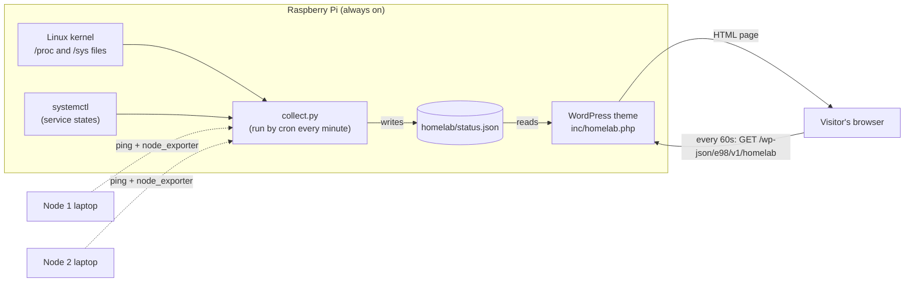

# Home Lab Monitor: How the Website Shows My Pi Status

**Date:** October 3, 2026
**Page:** https://manuel-elizaldi.com/technical-blogs-projects/home-lab/
**Pieces:** Python collector + cron → JSON file → WordPress theme (PHP) → REST API → JavaScript refresh

The Home Lab page shows a "Home Lab Monitor" window: a pixel slice of raspberry pie with a green **ONLINE** light, the Pi's specs (CPU, temperature, memory, disks, uptime, running services) and two laptops marked **NOT SET UP YET**. This note explains how that works, from the Linux kernel up to the browser.

---

## 1. The Architecture

The key idea: **the website never talks to the hardware directly.** Two separate programs do two separate jobs, and they communicate through one small file.



Step by step:
1. **Every minute**, cron (Linux's scheduler) runs `collect.py`.
2. `collect.py` reads the Pi's health numbers from Linux, checks the laptops, and writes everything into **`status.json`**.
3. A **visitor** opens the Home Lab page. WordPress reads `status.json` and turns it into the monitor window (HTML).
4. While the page stays open, a little **JavaScript** asks WordPress for a fresh copy of the window **every 60 seconds** and swaps it in without reloading the page.

This pattern is called **producer / consumer**: the collector *produces* data on its own schedule, the website *consumes* it whenever someone visits. Neither one waits for the other.

---

## 2. Why Not Just Check the Pi When Someone Visits?

It would seem simpler to have the web page run `ping` or read the temperature the moment someone loads it. I deliberately didn't, for three reasons:

| Reason | What could go wrong otherwise |
|---|---|
| **Security** | A public web page that runs system commands is a classic attack target. If anyone can trigger `ping <something>`, a bug could let them run *other* commands on my server. Here, visitors can only *read a file*. |
| **Speed** | Pinging an offline laptop waits for a timeout (1 second each). Every visitor would wait. Reading a JSON file takes microseconds. |
| **Load** | 100 visitors = 100 sets of commands. With the collector, it's always exactly one run per minute, no matter how many people visit. |

> **Rule of thumb:** keep slow or privileged work in a background job, and let the website only *read* the result.

---

## 3. Part 1: The Collector (`homelab/collect.py`)

Location: `/mnt/ssd/webpage/homelab/collect.py` (in the website repo, but *outside* the public `html/` folder).

### 3.1 Linux exposes hardware info as files

The most important fundamental here: **on Linux, a lot of system information looks like ordinary text files.** The kernel creates them on the fly in two special folders:
- `/proc` is about **processes and the system** (memory, load, uptime)
- `/sys` is about **devices and hardware** (temperature sensors, etc.)

Nothing is stored on disk; when you `cat` one of these files, the kernel generates the answer right then. So the collector just *reads files*, no special libraries needed:

| Shown on the site | Where it comes from | Try it in the terminal |
|---|---|---|
| Model | `/proc/device-tree/model` | `cat /proc/device-tree/model` |
| CPU load | `/proc/loadavg` (1, 5, 15 min averages) | `cat /proc/loadavg` |
| Temperature | `/sys/class/thermal/thermal_zone0/temp` (in millidegrees: `52900` = 52.9 °C) | `cat /sys/class/thermal/thermal_zone0/temp` |
| Memory | `/proc/meminfo` (`MemTotal`, `MemAvailable`) | `grep -E "MemTotal\|MemAvailable" /proc/meminfo` |
| Uptime | `/proc/uptime` (seconds since boot) | `cat /proc/uptime` |
| OS name | `/etc/os-release` | `cat /etc/os-release` |
| Disk use | Python's `shutil.disk_usage("/")` | `df -h / /mnt/ssd` |
| Running services | `systemctl is-active <service>` | `systemctl is-active apache2` |

Here's the Pi part of the collector. Notice it's mostly "read a file, do a little math":

```python
def pi_status():
    mem = dict(re.findall(r"^(\w+):\s+(\d+) kB", read("/proc/meminfo"), re.M))
    load = read("/proc/loadavg").split()
    ...
    return {
        "model": read("/proc/device-tree/model").replace("\x00", "") or "Raspberry Pi",
        "cores": os.cpu_count(),
        "load": [float(x) for x in load[:3]],
        "temp_c": round(int(read("/sys/class/thermal/thermal_zone0/temp", "0")) / 1000, 1),
        "mem": {"used": (int(mem["MemTotal"]) - int(mem["MemAvailable"])) * 1024, ...},
        "uptime_s": int(float(read("/proc/uptime", "0").split()[0])),
        ...
    }
```

**Understanding "load":** a load of `1.0` means one CPU core's worth of work is waiting/running. The Pi 5 has 4 cores, so the site shows the bar as `load ÷ cores`: a load of 2.0 on 4 cores is a half-full bar (50%).

**Why "MemAvailable" and not "MemFree":** Linux uses spare RAM as a disk cache, so "free" memory always looks tiny. `MemAvailable` is the honest number: how much programs could actually get if they asked.

### 3.2 Checking the laptops

For each laptop listed in `homelab/nodes.json`:

```json
{"name": "Node 1", "hardware": "Acer Nitro 5", "host": "", "exporter_port": 9100}
```

1. If `host` is empty → state **`setup`** ("NOT SET UP YET", yellow light). That's the current state.
2. Otherwise it runs `ping -c 1 -W 1 <host>` (send 1 packet, wait max 1 second).
   - No reply → **`offline`** (red light).
   - Reply → **`online`** (green light).
3. If online, it also tries to read `http://<host>:9100/metrics` from **Prometheus node_exporter** to get the same specs as the Pi.

**Why node_exporter?** The collector can read the Pi's `/proc` files because it runs *on* the Pi. It can't read files on another computer. node_exporter is a tiny program you install on each laptop that publishes that laptop's `/proc` and `/sys` numbers as a web page of text metrics, like:

```
node_load1 0.42
node_memory_MemTotal_bytes 1.6e+10
```

It's also exactly what Prometheus + Grafana use, so it's already part of my home lab plan. One install serves both.

### 3.3 The output: `status.json`

The collector writes one JSON file (trimmed):

```json
{
 "generated_at": 1791055021,
 "machines": [
  {"name": "Raspberry Pi", "state": "online", "cores": 4, "load": [0.16, ...], "temp_c": 52.4, ...},
  {"name": "Node 1", "hardware": "Acer Nitro 5", "state": "setup"},
  {"name": "Node 2", "hardware": "Acer Nitro 5", "state": "setup"}
 ]
}
```

`generated_at` is a **Unix timestamp**: seconds since January 1, 1970. Storing time as one number makes "how old is this?" a simple subtraction (used in section 5.2).

**Privacy:** the file only contains health numbers. No IP addresses or hostnames, because the website shows this to the whole internet.

### 3.4 The atomic write trick

The last lines of the collector:

```python
tmp = HERE / "status.json.tmp"
tmp.write_text(json.dumps(status, indent=1))
os.chmod(tmp, 0o644)
tmp.replace(HERE / "status.json")  # atomic, so the website never reads a half-written file
```

**The problem:** writing a file takes a moment. If a visitor's request reads `status.json` in the middle of a write, it gets half a file → broken JSON → broken page.

**The fix:** write to a temporary file first, then **rename** it over the real one. On Linux, a rename within the same folder is **atomic**: it happens all at once. A reader sees either the complete old file or the complete new file, never a mix.

`chmod 0o644` sets permissions to "owner can write, everyone can read". The collector runs as my user (`manu`) but Apache runs as `www-data`, so the file must be readable by others.

---

## 4. Part 2: Cron, the Scheduler

The collector runs from my **crontab** (my personal list of scheduled jobs). View it with `crontab -l`:

```
* * * * * /usr/bin/python3 /mnt/ssd/webpage/homelab/collect.py >> /home/manu/logs/homelab-collect.log 2>&1
```

Reading a cron line:

```
┌───────── minute        (* = every minute)
│ ┌─────── hour          (* = every hour)
│ │ ┌───── day of month
│ │ │ ┌─── month
│ │ │ │ ┌─ day of week
* * * * *  command to run
```

So `* * * * *` = every minute of every day. Compare with my Obsidian sync, `*/15 * * * *` = every 15 minutes.

The end of the line handles output:
- `>> file` **appends** normal output to the log file
- `2>&1` sends **errors** (stream 2) to the same place as normal output (stream 1)

The collector prints nothing when it works, so an **empty log means healthy**. If something breaks, the Python error lands in `~/logs/homelab-collect.log`.

**Cron gotcha:** cron runs with a minimal environment, not your shell's. That's why the line uses full paths (`/usr/bin/python3`, full script path) instead of just `python3 collect.py`.

---

## 5. Part 3: WordPress Reads the File (`inc/homelab.php`)

The theme code lives in `html/wp-content/themes/elizaldi98/inc/homelab.php`, loaded from `functions.php` with `require __DIR__ . '/inc/homelab.php';`.

### 5.1 Finding the file (and a symlink gotcha)

```php
define( 'E98_HOMELAB_JSON', dirname( realpath( ABSPATH ) ) . '/homelab/status.json' );
```

- `ABSPATH` is WordPress's own folder, `/mnt/ssd/webpage/html/`
- `dirname()` goes up one level → `/mnt/ssd/webpage`
- then append `/homelab/status.json`

**Why `realpath()`?** Apache serves the site from `/var/www/html`, which is a **symlink** (a shortcut) to `/mnt/ssd/webpage/html`. If `ABSPATH` came through as `/var/www/html/`, going "up one level" would give `/var/www`, the wrong folder. `realpath()` resolves the symlink to the real location first, so going up always lands in `/mnt/ssd/webpage`.

**Why keep the file outside `html/`?** Everything inside `html/` can be downloaded by anyone (it's the "document root"). `homelab/` sits one level above, so the raw file is private. Only what the theme chooses to display is public.

### 5.2 The "dead man's switch"

```php
define( 'E98_HOMELAB_STALE', 5 * MINUTE_IN_SECONDS );
...
if ( time() - (int) $status['generated_at'] > E98_HOMELAB_STALE ) {
    foreach ( $status['machines'] as &$m ) {
        $m['state'] = 'unknown';   // shown as "NO SIGNAL", grey light
    }
}
```

If the collector stops (cron broken, script crashed), `status.json` would keep saying "ONLINE" forever, which is a lie. So the theme checks the file's age: **older than 5 minutes → every machine shows "NO SIGNAL".** The data has to keep proving it's fresh. That's the "dead man's switch" idea: silence means trouble.

**An honest detail about the Pi's green light:** the website itself runs on the Pi. If the Pi were truly offline, the page wouldn't load at all. So for the Pi, the light really tells you "the Pi is up *and* the collector is reporting." For the laptops, it's a genuine remote check (ping).

### 5.3 Turning data into HTML

`e98_render_machine()` builds one row per machine:
- picks the light color from the state: `online` green, `offline` red, `setup` yellow, `unknown` grey (set by CSS classes like `state-online`)
- for online machines, builds the spec list. Each bar is a percentage, for example memory = `used ÷ total`, temperature = `temp ÷ 85 °C` (the Pi starts slowing itself down around 85 °C)
- formats numbers for humans: `e98_bytes()` turns `8454668288` into `8.5 GB`; `e98_uptime()` turns seconds into `45d 0h`

`e98_render_homelab()` wraps all the rows in the Win98-style window and returns it as a string. The Home Lab page template (`singular.php`) just echoes it:

```php
<?php if ( is_page( 'home-lab' ) ) : ?>
    <?php echo e98_render_homelab(); ?>
<?php endif; ?>
```

**Pixel art:** the pie and laptops are drawn from text grids, one character per pixel:

```
'..crrrrRrrrrpRrrrrcC',   c = crust, r = raspberry, R = dark raspberry, p = pink highlight
'..CCCCCCCCCCCCCCCCCC',   C = dark crust
'.wwwwwwwwwwwwwwwwwww',   w = plate
```

`e98_pixel_svg()` turns each character into a 1×1 square in an SVG image, and `shape-rendering="crispEdges"` keeps the squares sharp when scaled up. The steam is three extra "frames" that CSS shows one after another, like a GIF.

---

## 6. Part 4: Live Refresh Without Reloading

### 6.1 A tiny API endpoint

WordPress has a built-in **REST API**: URLs under `/wp-json/` that return data (JSON) instead of web pages. The theme adds its own endpoint:

```php
register_rest_route( 'e98/v1', '/homelab', array(
    'methods'             => 'GET',
    'permission_callback' => '__return_true',   // public, read-only
    'callback'            => function () {
        return array( 'html' => e98_render_homelab() );
    },
) );
```

Visit it yourself: https://manuel-elizaldi.com/wp-json/e98/v1/homelab. You'll see JSON with an `html` field containing the monitor window.

Notice it calls the **same** `e98_render_homelab()` as the page. That's deliberate: one function produces the HTML in both places, so the first page load and every refresh look identical. If I change the design, I change it once. (The alternative, sending raw numbers and rebuilding the HTML in JavaScript, would mean maintaining the same layout twice in two languages.)

### 6.2 Telling JavaScript where to ask

The script needs the API URL. Rather than hard-coding it, `functions.php` passes it from PHP to JavaScript:

```php
if ( is_page( 'home-lab' ) ) {
    wp_enqueue_script( 'e98-homelab', "$uri/assets/js/homelab.js", ... );
    wp_localize_script( 'e98-homelab', 'e98Homelab', array( 'url' => rest_url( 'e98/v1/homelab' ) ) );
}
```

- `wp_enqueue_script` adds the `<script>` tag, **only on the Home Lab page**, so other pages don't load it
- `wp_localize_script` prints a small JavaScript variable before it: `var e98Homelab = {"url": "https://manuel-elizaldi.com/wp-json/e98/v1/homelab"}`

### 6.3 The refresh loop (`assets/js/homelab.js`)

```js
setInterval(async () => {
  if (document.hidden) return;                       // tab not visible? skip
  try {
    const res = await fetch(e98Homelab.url, { cache: "no-store" });
    if (!res.ok) return;
    const { html } = await res.json();
    const el = document.getElementById("homelab-monitor");
    if (el && html) el.outerHTML = html;             // swap the whole window
  } catch (e) { /* keep showing the last reading */ }
}, 60000);
```

- `setInterval(..., 60000)` runs every 60,000 ms = 1 minute, matching the collector's schedule (refreshing faster would just fetch the same data)
- `document.hidden` skips the request when the tab is in the background, so idle tabs don't keep hitting my Pi
- `fetch()` asks the API; `cache: "no-store"` prevents the browser from reusing an old answer
- `outerHTML = html` replaces the whole monitor element with the new one
- `try/catch`: if the request fails (Wi-Fi blip), the page quietly keeps showing the last reading instead of breaking

---

## 7. The Whole Journey of One Number

Following the CPU temperature from sensor to screen:

1. The Pi's chip sensor → kernel → `/sys/class/thermal/thermal_zone0/temp` reads `52400`
2. Cron runs `collect.py` at 14:16:00 → `52400 / 1000` → `"temp_c": 52.4` in `status.json` (atomic rename)
3. A visitor opens the page → `e98_homelab_status()` reads the JSON, confirms it's < 5 minutes old
4. `e98_render_machine()` → bar at `52.4 / 85` ≈ 62% + text `52.4 °C`
5. One minute later, `homelab.js` fetches `/wp-json/e98/v1/homelab` → new HTML with the latest reading → swapped in

---

## 8. Problems & Solutions

| Problem | Solution |
|---|---|
| Visitors triggering system commands would be a security and speed risk | Background collector + JSON file; the site only reads |
| Half-written file could break the page | Write to `.tmp`, then atomic rename |
| `/var/www/html` is a symlink, so "one folder up" pointed to the wrong place | `realpath(ABSPATH)` before `dirname()` |
| If the collector dies, the page would show stale "ONLINE" forever | 5-minute staleness check → "NO SIGNAL" |
| Raw status file must not be public | Stored in `homelab/`, outside the `html/` document root; no IPs in it |
| Page and refresh could drift apart in design | One PHP render function used by both the page and the API |

---

## 9. Try It Yourself

```bash
# See the raw data the website reads
python3 -m json.tool /mnt/ssd/webpage/homelab/status.json

# Run the collector by hand (prints nothing if OK), then check the timestamp changed
python3 /mnt/ssd/webpage/homelab/collect.py && grep generated_at /mnt/ssd/webpage/homelab/status.json

# Convert a Unix timestamp to a date
date -d @1791055021

# Ask the API exactly what the JavaScript asks
curl -s https://manuel-elizaldi.com/wp-json/e98/v1/homelab | head -c 400

# Watch the file get rewritten every minute (Ctrl+C to stop)
watch -n 5 'ls -l --time-style=+%H:%M:%S /mnt/ssd/webpage/homelab/status.json'

# Raw kernel numbers
cat /proc/loadavg
cat /sys/class/thermal/thermal_zone0/temp
systemctl is-active apache2 mariadb pihole-FTL cloudflared docker

# Collector errors (empty = healthy)
cat ~/logs/homelab-collect.log
```

**Experiment:** open the Home Lab page, then keep one CPU core busy from a terminal with `yes > /dev/null &`. Within two minutes the CPU bar on the page climbs, without reloading. Stop it with `kill %1`.

---

## 10. Next Step: Adding the Laptops

1. On each laptop: `sudo apt install prometheus-node-exporter` (it starts automatically on port 9100). Test from the Pi: `curl -s http://<laptop-ip>:9100/metrics | grep node_load1`
2. Give each laptop a fixed IP in the router (DHCP reservation), so the address doesn't change.
3. Edit `/mnt/ssd/webpage/homelab/nodes.json` and fill in `"host": "192.168.0.x"` for each. Rename "Node 1/2" if you like.
4. Within a minute the laptops turn green and show their specs.

---

## File Map

| File | Role |
|---|---|
| `/mnt/ssd/webpage/homelab/collect.py` | Producer: gathers status, writes JSON |
| `/mnt/ssd/webpage/homelab/nodes.json` | My list of machines (edit to add laptops) |
| `/mnt/ssd/webpage/homelab/status.json` | The shared file (regenerated every minute, not in git) |
| `crontab -l` | Runs the collector every minute |
| `~/logs/homelab-collect.log` | Collector errors |
| `html/wp-content/themes/elizaldi98/inc/homelab.php` | Reads JSON, renders the window, REST endpoint, pixel art |
| `html/wp-content/themes/elizaldi98/assets/js/homelab.js` | Refreshes the window every minute |
| `html/wp-content/themes/elizaldi98/assets/css/main.css` | Monitor styles (search for "Home Lab monitor") |
| `html/wp-content/themes/elizaldi98/singular.php` | Puts the monitor on the Home Lab page |

## Glossary

- **/proc, /sys**: virtual folders where the Linux kernel exposes live system info as text files
- **cron / crontab**: Linux's job scheduler / my list of scheduled jobs
- **JSON**: a text format for structured data (`{"key": value}`), readable by Python, PHP and JavaScript alike
- **Atomic operation**: happens all at once or not at all; nobody sees it half-done
- **Document root**: the folder a web server makes public (`/mnt/ssd/webpage/html`)
- **Symlink**: a file-system shortcut pointing to another path
- **REST API**: URLs that return data instead of pages; WordPress's live under `/wp-json/`
- **node_exporter**: Prometheus agent that publishes a machine's metrics over HTTP (port 9100)
- **Unix timestamp**: seconds since 1970-01-01 UTC
- **Producer / consumer**: one process creates data, another uses it, decoupled through a buffer (here, a file)
