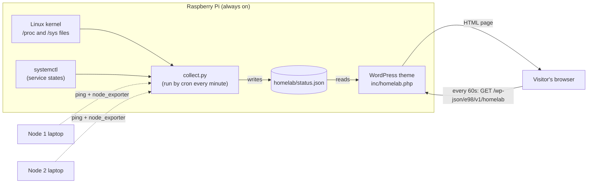
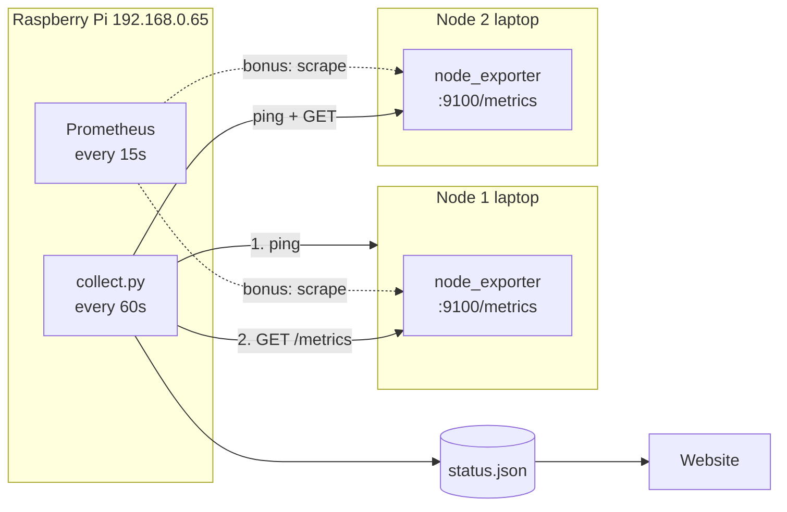

# Home Lab Monitor: How the Website Shows My Pi Status

**Date:** October 3, 2026 (section 10 added October 4, 2026)
**Page:** https://manuel-elizaldi.com/technical-blogs-projects/home-lab/
**Pieces:** Python collector + cron → JSON file → WordPress theme (PHP) → REST API → JavaScript refresh

The Home Lab page shows a "Home Lab Monitor" window: a pixel slice of raspberry pie with a green **ONLINE** light, the Pi's specs (CPU, temperature, memory, disks, uptime, running services) and two laptops marked **NOT SET UP YET**. This note explains how that works, from the Linux kernel up to the browser.

---

## 1. The Architecture

The key idea: **the website never talks to the hardware directly.** Two separate programs do two separate jobs, and they communicate through one small file.



Step by step:
1. **Every minute**, cron (Linux's scheduler) runs `collect.py`.
2. `collect.py` reads the Pi's health numbers from Linux, checks the laptops, and writes everything into **`status.json`**.
3. A **visitor** opens the Home Lab page. WordPress reads `status.json` and turns it into the monitor window (HTML).
4. While the page stays open, a little **JavaScript** asks WordPress for a fresh copy of the window **every 60 seconds** and swaps it in without reloading the page.

This pattern is called **producer / consumer**: the collector *produces* data on its own schedule, the website *consumes* it whenever someone visits. Neither one waits for the other.

---

## 2. Why Not Just Check the Pi When Someone Visits?

It would seem simpler to have the web page run `ping` or read the temperature the moment someone loads it. I deliberately didn't, for three reasons:

| Reason | What could go wrong otherwise |
|---|---|
| **Security** | A public web page that runs system commands is a classic attack target. If anyone can trigger `ping <something>`, a bug could let them run *other* commands on my server. Here, visitors can only *read a file*. |
| **Speed** | Pinging an offline laptop waits for a timeout (1 second each). Every visitor would wait. Reading a JSON file takes microseconds. |
| **Load** | 100 visitors = 100 sets of commands. With the collector, it's always exactly one run per minute, no matter how many people visit. |

> **Rule of thumb:** keep slow or privileged work in a background job, and let the website only *read* the result.

---

## 3. Part 1: The Collector (`homelab/collect.py`)

Location: `/mnt/ssd/webpage/homelab/collect.py` (in the website repo, but *outside* the public `html/` folder).

### 3.1 Linux exposes hardware info as files

The most important fundamental here: **on Linux, a lot of system information looks like ordinary text files.** The kernel creates them on the fly in two special folders:
- `/proc` is about **processes and the system** (memory, load, uptime)
- `/sys` is about **devices and hardware** (temperature sensors, etc.)

Nothing is stored on disk; when you `cat` one of these files, the kernel generates the answer right then. So the collector just *reads files*, no special libraries needed:

| Shown on the site | Where it comes from                                                          | Try it in the terminal                           |
| ----------------- | ---------------------------------------------------------------------------- | ------------------------------------------------ |
| Model             | `/proc/device-tree/model`                                                    | `cat /proc/device-tree/model`                    |
| CPU load          | `/proc/loadavg` (1, 5, 15 min averages)                                      | `cat /proc/loadavg`                              |
| Temperature       | `/sys/class/thermal/thermal_zone0/temp` (in millidegrees: `52900` = 52.9 °C) | `cat /sys/class/thermal/thermal_zone0/temp`      |
| Memory            | `/proc/meminfo` (`MemTotal`, `MemAvailable`)                                 | `grep -E "MemTotal\|MemAvailable" /proc/meminfo` |
| Uptime            | `/proc/uptime` (seconds since boot)                                          | `cat /proc/uptime`                               |
| OS name           | `/etc/os-release`                                                            | `cat /etc/os-release`                            |
| Disk use          | Python's `shutil.disk_usage("/")`                                            | `df -h / /mnt/ssd`                               |
| Running services  | `systemctl is-active <service>`                                              | `systemctl is-active apache2`                    |

Here's the Pi part of the collector. Notice it's mostly "read a file, do a little math":

```python
def pi_status():
    mem = dict(re.findall(r"^(\w+):\s+(\d+) kB", read("/proc/meminfo"), re.M))
    load = read("/proc/loadavg").split()
    ...
    return {
        "model": read("/proc/device-tree/model").replace("\x00", "") or "Raspberry Pi",
        "cores": os.cpu_count(),
        "load": [float(x) for x in load[:3]],
        "temp_c": round(int(read("/sys/class/thermal/thermal_zone0/temp", "0")) / 1000, 1),
        "mem": {"used": (int(mem["MemTotal"]) - int(mem["MemAvailable"])) * 1024, ...},
        "uptime_s": int(float(read("/proc/uptime", "0").split()[0])),
        ...
    }
```

**Understanding "load":** a load of `1.0` means one CPU core's worth of work is waiting/running. The Pi 5 has 4 cores, so the site shows the bar as `load ÷ cores`: a load of 2.0 on 4 cores is a half-full bar (50%).

**Why "MemAvailable" and not "MemFree":** Linux uses spare RAM as a disk cache, so "free" memory always looks tiny. `MemAvailable` is the honest number: how much programs could actually get if they asked.

### 3.2 Checking the laptops

For each laptop listed in `homelab/nodes.json`:

```json
{"name": "Node 1", "hardware": "Acer Nitro 5", "host": "", "exporter_port": 9100}
```

1. If `host` is empty → state **`setup`** ("NOT SET UP YET", yellow light). That's the current state.
2. Otherwise it runs `ping -c 1 -W 1 <host>` (send 1 packet, wait max 1 second).
   - No reply → **`offline`** (red light).
   - Reply → **`online`** (green light).
3. If online, it also tries to read `http://<host>:9100/metrics` from **Prometheus node_exporter** to get the same specs as the Pi.

**Why node_exporter?** The collector can read the Pi's `/proc` files because it runs *on* the Pi. It can't read files on another computer. node_exporter is a tiny program you install on each laptop that publishes that laptop's `/proc` and `/sys` numbers as a web page of text metrics, like:

```
node_load1 0.42
node_memory_MemTotal_bytes 1.6e+10
```

It's also exactly what Prometheus + Grafana use, so it's already part of my home lab plan. One install serves both.

### 3.3 The output: `status.json`

The collector writes one JSON file (trimmed):

```json
{
 "generated_at": 1791055021,
 "machines": [
  {"name": "Raspberry Pi", "state": "online", "cores": 4, "load": [0.16, ...], "temp_c": 52.4, ...},
  {"name": "Node 1", "hardware": "Acer Nitro 5", "state": "setup"},
  {"name": "Node 2", "hardware": "Acer Nitro 5", "state": "setup"}
 ]
}
```

`generated_at` is a **Unix timestamp**: seconds since January 1, 1970. Storing time as one number makes "how old is this?" a simple subtraction (used in section 5.2).

**Privacy:** the file only contains health numbers. No IP addresses or hostnames, because the website shows this to the whole internet.

### 3.4 The atomic write trick

The last lines of the collector:

```python
tmp = HERE / "status.json.tmp"
tmp.write_text(json.dumps(status, indent=1))
os.chmod(tmp, 0o644)
tmp.replace(HERE / "status.json")  # atomic, so the website never reads a half-written file
```

**The problem:** writing a file takes a moment. If a visitor's request reads `status.json` in the middle of a write, it gets half a file → broken JSON → broken page.

**The fix:** write to a temporary file first, then **rename** it over the real one. On Linux, a rename within the same folder is **atomic**: it happens all at once. A reader sees either the complete old file or the complete new file, never a mix.

`chmod 0o644` sets permissions to "owner can write, everyone can read". The collector runs as my user (`manu`) but Apache runs as `www-data`, so the file must be readable by others.

---

## 4. Part 2: Cron, the Scheduler

The collector runs from my **crontab** (my personal list of scheduled jobs). View it with `crontab -l`:

```
* * * * * /usr/bin/python3 /mnt/ssd/webpage/homelab/collect.py >> /home/manu/logs/homelab-collect.log 2>&1
```

Reading a cron line:

```
┌───────── minute        (* = every minute)
│ ┌─────── hour          (* = every hour)
│ │ ┌───── day of month
│ │ │ ┌─── month
│ │ │ │ ┌─ day of week
* * * * *  command to run
```

So `* * * * *` = every minute of every day. Compare with my Obsidian sync, `*/15 * * * *` = every 15 minutes.

The end of the line handles output:
- `>> file` **appends** normal output to the log file
- `2>&1` sends **errors** (stream 2) to the same place as normal output (stream 1)

The collector prints nothing when it works, so an **empty log means healthy**. If something breaks, the Python error lands in `~/logs/homelab-collect.log`.

**Cron gotcha:** cron runs with a minimal environment, not your shell's. That's why the line uses full paths (`/usr/bin/python3`, full script path) instead of just `python3 collect.py`.

---

## 5. Part 3: WordPress Reads the File (`inc/homelab.php`)

The theme code lives in `html/wp-content/themes/elizaldi98/inc/homelab.php`, loaded from `functions.php` with `require __DIR__ . '/inc/homelab.php';`.

### 5.1 Finding the file (and a symlink gotcha)

```php
define( 'E98_HOMELAB_JSON', dirname( realpath( ABSPATH ) ) . '/homelab/status.json' );
```

- `ABSPATH` is WordPress's own folder, `/mnt/ssd/webpage/html/`
- `dirname()` goes up one level → `/mnt/ssd/webpage`
- then append `/homelab/status.json`

**Why `realpath()`?** Apache serves the site from `/var/www/html`, which is a **symlink** (a shortcut) to `/mnt/ssd/webpage/html`. If `ABSPATH` came through as `/var/www/html/`, going "up one level" would give `/var/www`, the wrong folder. `realpath()` resolves the symlink to the real location first, so going up always lands in `/mnt/ssd/webpage`.

**Why keep the file outside `html/`?** Everything inside `html/` can be downloaded by anyone (it's the "document root"). `homelab/` sits one level above, so the raw file is private. Only what the theme chooses to display is public.

### 5.2 The "dead man's switch"

```php
define( 'E98_HOMELAB_STALE', 5 * MINUTE_IN_SECONDS );
...
if ( time() - (int) $status['generated_at'] > E98_HOMELAB_STALE ) {
    foreach ( $status['machines'] as &$m ) {
        $m['state'] = 'unknown';   // shown as "NO SIGNAL", grey light
    }
}
```

If the collector stops (cron broken, script crashed), `status.json` would keep saying "ONLINE" forever, which is a lie. So the theme checks the file's age: **older than 5 minutes → every machine shows "NO SIGNAL".** The data has to keep proving it's fresh. That's the "dead man's switch" idea: silence means trouble.

**An honest detail about the Pi's green light:** the website itself runs on the Pi. If the Pi were truly offline, the page wouldn't load at all. So for the Pi, the light really tells you "the Pi is up *and* the collector is reporting." For the laptops, it's a genuine remote check (ping).

### 5.3 Turning data into HTML

`e98_render_machine()` builds one row per machine:
- picks the light color from the state: `online` green, `offline` red, `setup` yellow, `unknown` grey (set by CSS classes like `state-online`)
- for online machines, builds the spec list. Each bar is a percentage, for example memory = `used ÷ total`, temperature = `temp ÷ 85 °C` (the Pi starts slowing itself down around 85 °C)
- formats numbers for humans: `e98_bytes()` turns `8454668288` into `8.5 GB`; `e98_uptime()` turns seconds into `45d 0h`

`e98_render_homelab()` wraps all the rows in the Win98-style window and returns it as a string. The Home Lab page template (`singular.php`) just echoes it:

```php
<?php if ( is_page( 'home-lab' ) ) : ?>
    <?php echo e98_render_homelab(); ?>
<?php endif; ?>
```

**Pixel art:** the pie and laptops are drawn from text grids, one character per pixel:

```
'..crrrrRrrrrpRrrrrcC',   c = crust, r = raspberry, R = dark raspberry, p = pink highlight
'..CCCCCCCCCCCCCCCCCC',   C = dark crust
'.wwwwwwwwwwwwwwwwwww',   w = plate
```

`e98_pixel_svg()` turns each character into a 1×1 square in an SVG image, and `shape-rendering="crispEdges"` keeps the squares sharp when scaled up. The steam is three extra "frames" that CSS shows one after another, like a GIF.

---

## 6. Part 4: Live Refresh Without Reloading

### 6.1 A tiny API endpoint

WordPress has a built-in **REST API**: URLs under `/wp-json/` that return data (JSON) instead of web pages. The theme adds its own endpoint:

```php
register_rest_route( 'e98/v1', '/homelab', array(
    'methods'             => 'GET',
    'permission_callback' => '__return_true',   // public, read-only
    'callback'            => function () {
        return array( 'html' => e98_render_homelab() );
    },
) );
```

Visit it yourself: https://manuel-elizaldi.com/wp-json/e98/v1/homelab. You'll see JSON with an `html` field containing the monitor window.

Notice it calls the **same** `e98_render_homelab()` as the page. That's deliberate: one function produces the HTML in both places, so the first page load and every refresh look identical. If I change the design, I change it once. (The alternative, sending raw numbers and rebuilding the HTML in JavaScript, would mean maintaining the same layout twice in two languages.)

### 6.2 Telling JavaScript where to ask

The script needs the API URL. Rather than hard-coding it, `functions.php` passes it from PHP to JavaScript:

```php
if ( is_page( 'home-lab' ) ) {
    wp_enqueue_script( 'e98-homelab', "$uri/assets/js/homelab.js", ... );
    wp_localize_script( 'e98-homelab', 'e98Homelab', array( 'url' => rest_url( 'e98/v1/homelab' ) ) );
}
```

- `wp_enqueue_script` adds the `<script>` tag, **only on the Home Lab page**, so other pages don't load it
- `wp_localize_script` prints a small JavaScript variable before it: `var e98Homelab = {"url": "https://manuel-elizaldi.com/wp-json/e98/v1/homelab"}`

### 6.3 The refresh loop (`assets/js/homelab.js`)

```js
setInterval(async () => {
  if (document.hidden) return;                       // tab not visible? skip
  try {
    const res = await fetch(e98Homelab.url, { cache: "no-store" });
    if (!res.ok) return;
    const { html } = await res.json();
    const el = document.getElementById("homelab-monitor");
    if (el && html) el.outerHTML = html;             // swap the whole window
  } catch (e) { /* keep showing the last reading */ }
}, 60000);
```

- `setInterval(..., 60000)` runs every 60,000 ms = 1 minute, matching the collector's schedule (refreshing faster would just fetch the same data)
- `document.hidden` skips the request when the tab is in the background, so idle tabs don't keep hitting my Pi
- `fetch()` asks the API; `cache: "no-store"` prevents the browser from reusing an old answer
- `outerHTML = html` replaces the whole monitor element with the new one
- `try/catch`: if the request fails (Wi-Fi blip), the page quietly keeps showing the last reading instead of breaking

---

## 7. The Whole Journey of One Number

Following the CPU temperature from sensor to screen:

1. The Pi's chip sensor → kernel → `/sys/class/thermal/thermal_zone0/temp` reads `52400`
2. Cron runs `collect.py` at 14:16:00 → `52400 / 1000` → `"temp_c": 52.4` in `status.json` (atomic rename)
3. A visitor opens the page → `e98_homelab_status()` reads the JSON, confirms it's < 5 minutes old
4. `e98_render_machine()` → bar at `52.4 / 85` ≈ 62% + text `52.4 °C`
5. One minute later, `homelab.js` fetches `/wp-json/e98/v1/homelab` → new HTML with the latest reading → swapped in

---

## 8. Problems & Solutions

| Problem | Solution |
|---|---|
| Visitors triggering system commands would be a security and speed risk | Background collector + JSON file; the site only reads |
| Half-written file could break the page | Write to `.tmp`, then atomic rename |
| `/var/www/html` is a symlink, so "one folder up" pointed to the wrong place | `realpath(ABSPATH)` before `dirname()` |
| If the collector dies, the page would show stale "ONLINE" forever | 5-minute staleness check → "NO SIGNAL" |
| Raw status file must not be public | Stored in `homelab/`, outside the `html/` document root; no IPs in it |
| Page and refresh could drift apart in design | One PHP render function used by both the page and the API |
| node_exporter serves metrics as text; a loose regex for `node_load1` could match the `node_load15` line | Labels must sit inside `{ }` in the pattern (section 10, Step 6) |

---

## 9. Try It Yourself

```bash
# See the raw data the website reads
python3 -m json.tool /mnt/ssd/webpage/homelab/status.json

# Run the collector by hand (prints nothing if OK), then check the timestamp changed
python3 /mnt/ssd/webpage/homelab/collect.py && grep generated_at /mnt/ssd/webpage/homelab/status.json

# Convert a Unix timestamp to a date
date -d @1791055021

# Ask the API exactly what the JavaScript asks
curl -s https://manuel-elizaldi.com/wp-json/e98/v1/homelab | head -c 400

# Watch the file get rewritten every minute (Ctrl+C to stop)
watch -n 5 'ls -l --time-style=+%H:%M:%S /mnt/ssd/webpage/homelab/status.json'

# Raw kernel numbers
cat /proc/loadavg
cat /sys/class/thermal/thermal_zone0/temp
systemctl is-active apache2 mariadb pihole-FTL cloudflared docker

# Collector errors (empty = healthy)
cat ~/logs/homelab-collect.log
```

**Experiment:** open the Home Lab page, then keep one CPU core busy from a terminal with `yes > /dev/null &`. Within two minutes the CPU bar on the page climbs, without reloading. Stop it with `kill %1`.

---

## 10. Hands-On: Adding Node 1 and Node 2 Myself

This section is a by-hand walkthrough. Nothing in the website code needs to change: the laptops show up just by preparing each laptop and editing one config file. That's the payoff of the architecture above. I'll do each step myself and check the ✅ result before moving on.

> **Tested:** on October 4, 2026, I ran a temporary node_exporter on the Pi as a stand-in laptop and pointed the collector at it. All three laptop states (online with specs, online without specs, offline) worked, and the website drew the full spec rows. That test also caught a small bug in the metric-matching pattern, explained in Step 6.

### 10.0 What I'm building



For each laptop, the collector asks two separate questions, and each one unlocks part of the display:

| Question | How | If yes | If no |
|---|---|---|---|
| Is the laptop on the network? | `ping` (ICMP, the network's "are you there?") | green **ONLINE** | red **OFFLINE** |
| Can I read its health numbers? | HTTP request to `:9100/metrics` | specs + bars appear | stays green, no specs |

So I'll build it in that order: first make the laptop *pingable* and watch the light turn green, then add node_exporter and watch the specs appear.

### What I already have on the Pi (found while writing this)

My Pi already runs the monitoring stack from Home Lab Phase 1, so I'm repeating something I've done before:

| Service | Port | What it is |
|---|---|---|
| `node_exporter` 1.8.2 | 9100 | Installed by hand: binary in `/usr/local/bin/`, its own `node_exporter` system user, a systemd service |
| `prometheus` | 9090 | Scrapes the Pi's node_exporter every 15s (job name `pi`) |
| `grafana-server` | 3000 | Dashboards on top of Prometheus |
| Uptime Kuma (Docker) | 3001 | Uptime checks |

See my own setup with `systemctl cat node_exporter` and `cat /etc/prometheus/prometheus.yml`.

### Prerequisites for each laptop

- Running **Linux** (Ubuntu or Debian). Proxmox, when I install it later, is Debian underneath, so every step here works the same on a Proxmox host. *(Windows won't work with this collector: Windows uses a different exporter, `windows_exporter` on port 9182, whose metric names are different.)*
- Plugged into the **same home network** as the Pi.
- I can open a terminal on it, ideally over SSH from my main computer (`sudo apt install openssh-server` on the laptop, then [[Creating a key pair on raspberry pi|key-based login]]).
- **Doesn't sleep when the lid closes.** A laptop server that suspends looks "offline". Fix it once:
  ```bash
  sudo nano /etc/systemd/logind.conf
  # set these two lines (remove the leading #):
  #   HandleLidSwitch=ignore
  #   HandleLidSwitchExternalPower=ignore
  sudo systemctl restart systemd-logind
  ```

---

### Step 1: Find the laptop's address and test it from the Pi

**Concept: IP addresses on my LAN.** Every device on my home network gets an address like `192.168.0.x`. My router is `192.168.0.1`, the Pi is `192.168.0.65` (wired) and `.66` (Wi-Fi). The `192.168.x.x` range is *private*: it only works inside my home, which is why the Pi can reach the laptops but the internet can't.

On the **laptop**:
```bash
hostname -I          # prints its address(es), e.g. 192.168.0.70
ip -4 addr           # more detail: which network card has which address
```

On the **Pi**:
```bash
ping -c 3 192.168.0.70     # use the laptop's real address
```

✅ **Checkpoint:** three replies like `64 bytes from 192.168.0.70: icmp_seq=1 ttl=64 time=3.1 ms`.

If not: the laptop is asleep, on a different network (guest Wi-Fi?), or its firewall blocks ping. Check Troubleshooting at the end.

### Step 2: Make the address permanent

**Concept: DHCP leases.** Devices don't choose their own addresses; the router *lends* them one (a "lease") through DHCP. Leases can change after a reboot or a few days. If Node 1 is `.70` today and `.73` next week, my config points at the wrong machine.

**Fix (recommended): DHCP reservation**, telling the router "always give this device the same address":
1. On the laptop, find its network card's **MAC address**, the card's permanent hardware ID: `ip link` → the `link/ether aa:bb:cc:dd:ee:ff` line of the card that has the IP.
2. Open the router admin page (`http://192.168.0.1` in a browser), find **DHCP** / **Address Reservation** / **Static Lease** (the name varies by brand), and reserve the laptop's current address for that MAC.
3. Reboot the laptop and confirm `hostname -I` shows the same address.

(If Pi-hole is handing out addresses instead of the router, the reservation lives in the Pi-hole admin: **Settings → DHCP**.)

**Alternative: Tailscale.** My Pi already runs Tailscale. If I install it on a laptop (`curl -fsSL https://tailscale.com/install.sh | sh` then `sudo tailscale up`), it gets a permanent `100.x.y.z` address and a name, reachable even from outside my home. I could put that in the config instead. It's simpler to keep stable, but it adds one more moving part to debug, so for learning I'd start with the LAN address.

✅ **Checkpoint:** after a laptop reboot, it still has the same address, and `ping` from the Pi still works.

### Step 3: The first half: turn the light green (ping only)

Open the machine list on the Pi:

```bash
nano /mnt/ssd/webpage/homelab/nodes.json
```

Fill in `host` for Node 1 only:

```json
{"name": "Node 1", "hardware": "Acer Nitro 5", "host": "192.168.0.70", "exporter_port": 9100},
```

JSON is strict: keep the double quotes and the commas between entries exactly as they were. Validate it:

```bash
python3 -m json.tool /mnt/ssd/webpage/homelab/nodes.json > /dev/null && echo "valid JSON"
```

Don't wait for cron; run the collector myself and look at what it produced:

```bash
python3 /mnt/ssd/webpage/homelab/collect.py
python3 -m json.tool /mnt/ssd/webpage/homelab/status.json | grep -A 3 '"Node 1"'
```

I expect `"state": "online"` and **no** specs yet, because node_exporter isn't installed. This is the code that decided it (`collect.py`):

```python
def node_status(cfg):
    base = {"name": cfg["name"], "hardware": cfg.get("hardware", "")}
    host = cfg.get("host", "").strip()
    if not host:
        return {**base, "state": "setup"}         # before Step 3: "NOT SET UP YET"
    if not ping(host):
        return {**base, "state": "offline"}       # red light
    return {**base, "state": "online", **exporter_status(host, cfg.get("exporter_port", 9100))}
```

Read it like a decision tree: no address → `setup`; address but no ping reply → `offline`; ping reply → `online`, plus whatever `exporter_status()` can find. Right now `exporter_status()` can't connect, so it returns `{}` (empty), and `**{}` adds nothing. That's why the light is green with no details.

✅ **Checkpoint:** the Home Lab page shows Node 1 with a green **ONLINE** light (refresh, or wait up to a minute) and a colored laptop icon, but no spec rows.

**Experiment:** unplug the laptop's network cable (or turn off its Wi-Fi), run `collect.py` again → red **OFFLINE**. Plug it back in → green.

### Step 4: Install node_exporter on the laptop (same way as on my Pi)

Everything here runs **on the laptop**. The Nitro 5 is an Intel/AMD machine, so I need the **amd64** build (the Pi uses arm64).

**4a. Download and install the program**

```bash
cd /tmp
VER=1.8.2     # same version as my Pi; check github.com/prometheus/node_exporter/releases for newer
curl -LO https://github.com/prometheus/node_exporter/releases/download/v$VER/node_exporter-$VER.linux-amd64.tar.gz
tar xzf node_exporter-$VER.linux-amd64.tar.gz
sudo cp node_exporter-$VER.linux-amd64/node_exporter /usr/local/bin/
node_exporter --version
```

`/usr/local/bin` is the standard home for programs I install myself (as opposed to `/usr/bin`, which belongs to the package manager).

**4b. Give it its own user**

```bash
sudo useradd --system --no-create-home --shell /usr/sbin/nologin node_exporter
```

**Concept: least privilege.** node_exporter is a network service anyone on my LAN can talk to. Running it as a dedicated user that can't log in and owns nothing means that even if it had a security bug, an attacker would land in an account that can't do much. Never run network services as root if they don't need it.

**4c. Make it a systemd service**

Create the service file (the same one my Pi uses):

```bash
sudo nano /etc/systemd/system/node_exporter.service
```

```ini
[Unit]
Description=Prometheus Node Exporter
After=network.target

[Service]
User=node_exporter
ExecStart=/usr/local/bin/node_exporter
Restart=on-failure

[Install]
WantedBy=multi-user.target
```

What each line means:
- `After=network.target`: start after networking is up
- `User=node_exporter`: run as the user from 4b
- `ExecStart=`: the program to run
- `Restart=on-failure`: if it crashes, systemd starts it again automatically
- `WantedBy=multi-user.target`: start at boot (when the machine reaches normal operating mode)

Load and start it:

```bash
sudo systemctl daemon-reload                  # make systemd re-read service files
sudo systemctl enable --now node_exporter     # enable = start at every boot, --now = also start right now
systemctl status node_exporter                # should say "active (running)"
```

**4d. Check it from the laptop itself**

```bash
ss -tlnp | grep 9100                                       # something is LISTENing on port 9100
curl -s http://localhost:9100/metrics | grep '^node_load1 '
```

`ss -tln` lists ports that programs are listening on. `*:9100` means "on every network card", which is what I want, so the Pi can reach it.

✅ **Checkpoint:** `node_load1 0.15` (or similar) prints.

*Shortcut I'm skipping on purpose:* `sudo apt install prometheus-node-exporter` does 4a–4c in one command, but with an older version and a different service name. Doing it by hand teaches what a "service" really is, and keeps all three machines identical.

### Step 5: Open the laptop's firewall to the Pi only

Check whether the laptop runs a firewall:

```bash
sudo ufw status
```

If it says `inactive`, skip this step. If `active`, allow port 9100 **only from my home network**:

```bash
sudo ufw allow from 192.168.0.0/24 to any port 9100 proto tcp
```

`192.168.0.0/24` is **CIDR notation** for "every address from 192.168.0.0 to 192.168.0.255", meaning my LAN, including both of the Pi's addresses. (To be stricter: `from 192.168.0.65`.)

**Security note:** node_exporter has no password. That's fine *inside* my home network, but I must never forward port 9100 in my router. My website reaches the internet only through the Cloudflare Tunnel, which exposes the website and nothing else.

### Step 6: Read the laptop's metrics from the Pi (the collector's point of view)

Back **on the Pi**, ask exactly what the collector asks:

```bash
curl -s http://192.168.0.70:9100/metrics | grep -E '^node_load1 |^node_memory_Mem(Total|Available)_bytes|^node_boot_time_seconds|^node_os_info'
```

Example output (from my stand-in test):

```
node_boot_time_seconds 1.787071451e+09
node_load1 0.37
node_memory_MemAvailable_bytes 6.68e+09
node_memory_MemTotal_bytes 8.454668288e+09
node_os_info{id="debian",name="Debian GNU/Linux",pretty_name="Debian GNU/Linux 12 (bookworm)",...} 1
```

**Concept: the Prometheus text format.** Every line is `name value` or `name{labels} value`:
- `8.454668288e+09` is scientific notation: 8.45 × 10⁹ bytes = 8.5 GB
- **labels** in `{ }` tell apart several measurements with the same name. For example, there's one `node_filesystem_size_bytes` per disk, labeled with its `mountpoint`
- `node_os_info{...} 1` is an "info" metric: the value is always 1, and the useful data lives in the labels

How each website row maps to a metric, and how `exporter_status()` computes it:

| Website row | Metric(s) | Math |
|---|---|---|
| OS | `node_os_info{pretty_name="..."}` | read the label |
| CPU cores | `node_cpu_seconds_total{cpu="0"...}`, `{cpu="1"...}`... | count distinct `cpu` numbers |
| CPU load | `node_load1`, `node_load5`, `node_load15` | as-is |
| Temp | `node_hwmon_temp_celsius{...}` (one per sensor) | the hottest sensor |
| Memory | `node_memory_MemTotal_bytes`, `node_memory_MemAvailable_bytes` | used = total − available |
| Disk | `node_filesystem_size_bytes` / `_avail_bytes` with `mountpoint="/"` | used = size − available |
| Uptime | `node_boot_time_seconds` (a Unix timestamp) | now − boot time |

The heart of `exporter_status()` is this little helper, which finds one metric's value with a **regular expression** (a text-matching pattern):

```python
def val(name, labels=""):
    # "name value" or "name{...labels...} value"; labels must sit inside { } so
    # node_load1 can never match the node_load15 line
    m = re.search(rf"^{name}(?:{{[^}}\n]*{labels}[^}}\n]*}})? ([0-9.e+-]+)$", text, re.M)
    return float(m.group(1)) if m else None
```

Reading the pattern for `val("node_load1")`:
- `^node_load1`: a line starting with the metric name
- `(?:\{ ... \})?`: optionally a `{...}` block of labels, which must contain the requested label if one was given (like `mountpoint="/"`)
- ` ([0-9.e+-]+)$`: a space, then the number at the end of the line, captured

**The bug this pattern fixes (a real lesson from testing):** the first version made the braces optional *separately* from the labels, so for `node_load1` the "labels" part could swallow the `5` of `node_load15`, and `node_load15 0.09` matched as if it were `node_load1`. It only worked because node_exporter happens to print `node_load1` first. Requiring labels to live *inside* `{ }` makes the match exact. When parsing text by hand, think about which *other* lines your pattern could accidentally match.

✅ **Checkpoint:** the curl command prints the lines. If it prints nothing, see Troubleshooting ("connection refused" / "timeout").

### Step 7: Watch the specs appear

```bash
python3 /mnt/ssd/webpage/homelab/collect.py
python3 -m json.tool /mnt/ssd/webpage/homelab/status.json | grep -A 12 '"Node 1"'
```

Now Node 1's entry has `os`, `cores`, `load`, `temp_c`, `mem`, `disks`, `uptime_s`, the same shape as the Pi's entry. The website's `e98_render_machine()` doesn't care which machine the data came from: it draws whatever fields exist. That's why no PHP changes are needed.

✅ **Checkpoint:** on the Home Lab page, Node 1 shows OS, CPU, Temp, Memory, Disk and Uptime rows with progress bars. (No "Running" services row, since the collector only checks services on the Pi itself.)

### Step 8: Node 2, and renaming

Repeat **Steps 1–7** on the second laptop and fill in its `host`. While I'm in `nodes.json`, I can rename the machines; the `name` field is only a label for the website:

```json
{"name": "nitro-1", "hardware": "Acer Nitro 5 · Proxmox", "host": "192.168.0.70", "exporter_port": 9100},
{"name": "nitro-2", "hardware": "Acer Nitro 5 · Proxmox", "host": "192.168.0.71", "exporter_port": 9100}
```

**Architecture lesson: configuration vs code.** Adding a third machine someday is one more line in `nodes.json`, with no programming. Keeping *what* to monitor (config) separate from *how* to monitor (code) is what makes a system easy to grow.

### Step 9 (bonus): Add the laptops to Prometheus and Grafana

The same node_exporter on each laptop can also feed my existing Prometheus/Grafana. One agent, two consumers.

On the **Pi**, edit Prometheus's config (YAML: **indentation is meaning**, use spaces, never tabs):

```bash
sudo nano /etc/prometheus/prometheus.yml
```

```yaml
global:
  scrape_interval: 15s
  evaluation_interval: 15s

scrape_configs:
  - job_name: "pi"
    static_configs:
      - targets: ["localhost:9100"]

  - job_name: "nodes"
    static_configs:
      - targets: ["192.168.0.70:9100", "192.168.0.71:9100"]
```

Check it before applying (Prometheus refuses to start with a broken config), then restart:

```bash
promtool check config /etc/prometheus/prometheus.yml
sudo systemctl restart prometheus
```

Open `http://192.168.0.65:9090/targets` from a computer at home: the `nodes` job should list both laptops as **UP**. In Grafana (`http://192.168.0.65:3000`), the community dashboard **"Node Exporter Full" (ID 1860)** gives detailed graphs for all three machines: Dashboards → New → Import → `1860`.

**Concept: pull vs push.** Both Prometheus (every 15s) and my collector (every 60s) *pull*: they reach out and ask each exporter. The laptops never send anything on their own. Pull-based monitoring means a machine that dies simply stops answering, which is exactly how "offline" gets detected.

### Step 10: Break it on purpose (understand every state)

| Do this | Expected on the website | Why |
|---|---|---|
| On a laptop: `sudo systemctl stop node_exporter` | green ONLINE, specs disappear | ping works, `/metrics` doesn't → `exporter_status()` returns `{}` |
| Unplug the laptop's network | red OFFLINE | ping fails, so the collector doesn't even try `/metrics` |
| Put a wrong `exporter_port` in `nodes.json` (e.g. 9101) | green ONLINE, no specs | same as stopping the exporter |
| Set `host` back to `""` | yellow NOT SET UP YET | the first branch of `node_status()` |
| On the Pi: comment out the cron line (`crontab -e`, add `#`) and wait 6 minutes | every machine: grey NO SIGNAL | `status.json` is older than 5 minutes (section 5.2) |

**Undo everything afterward:** `sudo systemctl start node_exporter`, plug the cable back in, restore the port and host, and remove the `#` from the cron line.

### Exercise: make the Pi use its own node_exporter

The Pi's row is built by reading `/proc` and `/sys` directly (section 3.1), while the laptops use node_exporter. But the Pi *also* runs node_exporter on `localhost:9100`. Challenge: change `collect.py` so the Pi's specs come from `exporter_status("localhost", 9100)` too, keeping only the "Running" services check local.

Hints: in `main()`, the Pi entry is built with `**pi_status()`; merge in `exporter_status("localhost", 9100)` and keep `model` and `services` from `pi_status()`. What do you gain (one code path for all machines, the same numbers as Grafana)? What do you lose (if node_exporter on the Pi stops, the Pi's specs vanish too)? That trade-off, one uniform path vs. fewer dependencies, comes up constantly in system design.

### Troubleshooting

| Symptom | Likely cause | Check / fix |
|---|---|---|
| `ping` from the Pi: `Destination Host Unreachable` | Wrong address, or laptop on another network | `hostname -I` on the laptop; same Wi-Fi/LAN as the Pi? |
| `ping` works, then randomly stops | Laptop suspends or its DHCP address changed | Lid-switch setting (Prerequisites); DHCP reservation (Step 2) |
| `curl ...:9100/metrics` → `Connection refused` | Nothing listening: service not running | On laptop: `systemctl status node_exporter`, `journalctl -u node_exporter -n 20` |
| `curl` just hangs, then times out | Firewall dropping the request | `sudo ufw status` on laptop; Step 5 |
| Website: green but no specs, curl works fine | Wrong `exporter_port` in `nodes.json`, or the collector hasn't run since | Fix the port; run `collect.py` by hand |
| Website: still yellow after editing `nodes.json` | JSON typo, so the collector crashed | `python3 -m json.tool nodes.json`; `cat ~/logs/homelab-collect.log` |
| Website: everything grey NO SIGNAL | Collector not running (cron) | `crontab -l`; run `collect.py` by hand and read the error |
| Temp row missing on a laptop | No hardware sensors exposed to Linux | `curl -s ...:9100/metrics \| grep hwmon_temp`; try `sudo apt install lm-sensors && sudo sensors-detect` |
| Prometheus target **DOWN** but the website works | Typo in `prometheus.yml` targets | `promtool check config ...`; compare addresses |

---

## File Map

| File | Role |
|---|---|
| `/mnt/ssd/webpage/homelab/collect.py` | Producer: gathers status, writes JSON |
| `/mnt/ssd/webpage/homelab/nodes.json` | My list of machines (edit to add laptops, section 10) |
| `/etc/systemd/system/node_exporter.service` | node_exporter as a service (Pi now, laptops in Step 4) |
| `/etc/prometheus/prometheus.yml` | What Prometheus scrapes (Step 9 adds the laptops) |
| `/mnt/ssd/webpage/homelab/status.json` | The shared file (regenerated every minute, not in git) |
| `crontab -l` | Runs the collector every minute |
| `~/logs/homelab-collect.log` | Collector errors |
| `html/wp-content/themes/elizaldi98/inc/homelab.php` | Reads JSON, renders the window, REST endpoint, pixel art |
| `html/wp-content/themes/elizaldi98/assets/js/homelab.js` | Refreshes the window every minute |
| `html/wp-content/themes/elizaldi98/assets/css/main.css` | Monitor styles (search for "Home Lab monitor") |
| `html/wp-content/themes/elizaldi98/singular.php` | Puts the monitor on the Home Lab page |

## Glossary

- **/proc, /sys**: virtual folders where the Linux kernel exposes live system info as text files
- **cron / crontab**: Linux's job scheduler / my list of scheduled jobs
- **JSON**: a text format for structured data (`{"key": value}`), readable by Python, PHP and JavaScript alike
- **Atomic operation**: happens all at once or not at all; nobody sees it half-done
- **Document root**: the folder a web server makes public (`/mnt/ssd/webpage/html`)
- **Symlink**: a file-system shortcut pointing to another path
- **REST API**: URLs that return data instead of pages; WordPress's live under `/wp-json/`
- **node_exporter**: Prometheus agent that publishes a machine's metrics over HTTP (port 9100)
- **ICMP / ping**: the network's "are you there?" message
- **DHCP lease / reservation**: an address the router lends a device / a promise to always lend it the same one
- **MAC address**: a network card's permanent hardware ID
- **CIDR (`192.168.0.0/24`)**: shorthand for a range of addresses, here my whole home network
- **systemd service**: a program Linux starts at boot and restarts if it crashes
- **Least privilege**: give each program only the permissions it needs
- **Pull-based monitoring**: the monitor asks each machine, rather than machines reporting in
- **Unix timestamp**: seconds since 1970-01-01 UTC
- **Producer / consumer**: one process creates data, another uses it, decoupled through a buffer (here, a file)
