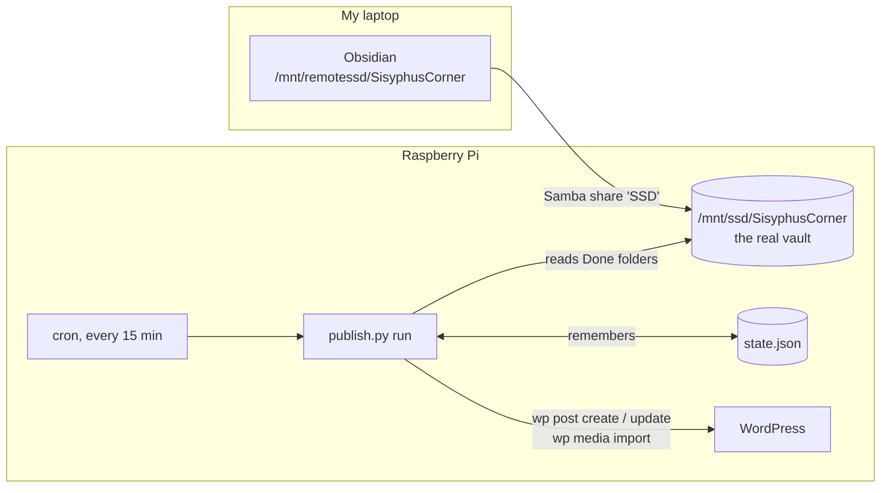

# Obsidian → WordPress Publisher: Build It By Hand

**Date:** October 4, 2026
**Goal:** move a finished note into a Done folder in Obsidian, and a few minutes later it's a post on manuel-elizaldi.com, cover image included.
**Language:** Python 3 (system Python, nothing to install) + WP-CLI + cron
**Time:** one or two evenings, in 10 phases, each ending with a ✅ checkpoint.

| Obsidian folder (Pi path) | Becomes |
|---|---|
| `Writing/Entries/Done` | a **Dry Negroni** post |
| `Writing/Technical/Done` | a **Technical Blogs & Projects** post |

> **Tested:** every code block was run on my Pi on October 4, 2026, before writing it down. I ran the baseline and a dry run against my real vault and website (both change nothing), then published a throwaway note as a hidden draft to check images, line breaks, links, highlights, tables, code blocks, the cover image and updates. Then I deleted it. Testing caught two real bugs, which are fixed in the code below and explained where they come up.

---

## 0. The Architecture



**One folder, two names.** On my laptop the vault is `/mnt/remotessd/SisyphusCorner`, but that's the Pi's SSD shared over the network with **Samba** (the share is called `SSD`). On the Pi itself, the same files live at `/mnt/ssd/SisyphusCorner`. The publisher runs on the Pi, so **every path in the code uses `/mnt/ssd/...`**. When I drop a note into `/mnt/remotessd/.../Done` on the laptop, it's instantly in `/mnt/ssd/.../Done` on the Pi, because it's the same file.

**Why not a symbolic link from the website to the vault?** WordPress doesn't read posts from files; it stores them in its database. A symlink would only make the raw `.md` files downloadable, and could expose private notes. The publisher instead *reads* the vault and *writes* to WordPress through its official command-line tool.

### The tricky part: what's already there

My Done folders and my website don't line up:
- **Notes in Done that are already posts** (some with the same title, some renamed, like "Bash Obsidian Backup Automation", which is the post "My Pi Lost Connection. I Lost My Notes...")
- **Notes in Done that were never published** (about 12, like "A Day In Austin, Texas" and the "Hats I Love" series)
- **Posts on the site with no note in Done** (Espresso Bar, PyStrava, the learning-series posts...)
- **One note in both Done folders** ("F50 Physical AI Summit")

A naive "publish everything in Done" would create ~20 duplicates on the first run. So the publisher sorts every note into one of four **modes** and remembers it in `state.json`:

| Mode | Meaning | What the publisher does |
|---|---|---|
| `published` | The publisher created this post | Keeps it in sync: if I edit the note, the post updates |
| `linked` | The post existed before the publisher | **Never touches it** (I may have hand-tuned it in WordPress) |
| `backlog` | Was in Done before the publisher started | Ignores it until I say `publish.py publish "<note>"` |
| `duplicate` | Same file name already handled from the other Done folder | Ignores it |

And posts with no note in Done? The publisher only knows about notes, so **those posts are never touched**. Three more safety rules:
1. **It never deletes anything.** Removing a note from Done leaves the post alone.
2. **It waits until a note has been untouched for 10 minutes** before publishing it, so Obsidian's autosave or a half-finished copy over the network never goes live.
3. **The first run (`baseline`) publishes nothing.** It only takes inventory.

### The files

| File | Job |
|---|---|
| `config.py` | Paths, folder → category map, settings |
| `state.py` | Load/save the publisher's memory (`state.json`) |
| `obsidian.py` | Find Done notes, read them, convert Obsidian markdown to HTML |
| `wordpress.py` | Create/update posts and upload images through WP-CLI |
| `publish.py` | The command: `baseline`, `run`, `status`, `link`, `publish` |

---

## Phase 1: Project Folder

```bash
mkdir -p /mnt/ssd/webpage/publisher
cd /mnt/ssd/webpage/publisher
printf '\n# Publisher\npublisher/__pycache__/\npublisher/state.json.tmp\n' >> /mnt/ssd/webpage/.gitignore
```

`state.json` itself stays **in git on purpose**. It's the publisher's memory, and if I lost it, the next baseline wouldn't know which posts it had created. Committing it now and then is a free backup.

The markdown converter is the `python3-markdown` package, which is already installed on my Pi. Check:

```bash
/usr/bin/python3 -c "import markdown; print(markdown.__version__)"     # 3.4.1
```

(I use `/usr/bin/python3` everywhere because that's the Python cron will use, so I test with the same one.)

---

## Phase 2: Settings (`config.py`)

```python
"""Settings for the Obsidian -> WordPress publisher."""
from pathlib import Path

BASE = Path(__file__).resolve().parent                 # /mnt/ssd/webpage/publisher
VAULT = Path("/mnt/ssd/SisyphusCorner")                # same folder as /mnt/remotessd/... on my other computer
WP_PATH = "/mnt/ssd/webpage/html"                      # the WordPress install
WP_CLI = "/usr/local/bin/wp"                           # full path: cron does not search /usr/local/bin
STATE_PATH = BASE / "state.json"                       # what the publisher remembers
LOG_PREFIX = "[publisher]"

# Done folder (inside the vault) -> WordPress category slug
FOLDERS = {
    "Writing/Entries/Done": "drynegroni",
    "Writing/Technical/Done": "technical-blogs-projects",
}

POST_STATUS = "publish"     # use "draft" while testing: drafts aren't visible on the site
SETTLE_MINUTES = 10         # only touch notes I haven't edited for this long
```

- `FOLDERS` is a dictionary from folder to **category slug** (the category's short URL name). Adding a folder later, like `Programming/Home Lab/Done` → `devlog`, is one more line.
- `WP_CLI` is the full path to the `wp` command. **Cron runs with a minimal PATH** (just `/usr/bin:/bin`), so plain `wp` would work in my terminal but fail in cron with "command not found". Full paths avoid that whole class of bugs.
- `POST_STATUS = "draft"` creates hidden posts that only I can see in the WordPress admin. Perfect for testing.

✅ **Checkpoint:** `/usr/bin/python3 -c "import config; print(config.VAULT.exists())"` prints `True`.

---

## Phase 3: Memory (`state.py`)

```python
"""The publisher's memory: which note became which post. Saved as JSON."""
import json
import os
from config import STATE_PATH


def load():
    if STATE_PATH.exists():
        return json.loads(STATE_PATH.read_text())
    return {"notes": {}, "media": {}}


def save(state):
    tmp = STATE_PATH.with_suffix(".json.tmp")
    tmp.write_text(json.dumps(state, indent=1, ensure_ascii=False, sort_keys=True))
    os.replace(tmp, STATE_PATH)          # atomic, like the Home Lab collector
```

The publisher's whole memory is one JSON file, shaped like:

```json
{
 "baseline": "2026-10-04T13:10:00",
 "notes": {
  "Writing/Entries/Done/Running For My Problems.md": {"mode": "linked", "post_id": 86, "category": "drynegroni"},
  "Writing/Entries/Done/A Day In Austin, Texas.md": {"mode": "backlog", "category": "drynegroni"}
 },
 "media": {"/mnt/ssd/SisyphusCorner/Resources/Pasted image 2025....png": {"id": 199, "url": "https://..."}}
}
```

- Keys are paths **relative to the vault**, so the file still makes sense if the vault moves.
- `media` remembers uploaded images, so editing a note doesn't upload its images again.
- `save()` uses the **atomic write** trick from the Home Lab note (write `.tmp`, then rename), so a crash mid-save can't corrupt my memory file. `os.replace` is the standard-library way to do the rename.

✅ **Checkpoint:** `/usr/bin/python3 -c "import state; print(state.load())"` prints `{'notes': {}, 'media': {}}`.

---

## Phase 4: Reading Obsidian (`obsidian.py`)

```python
"""Reading Obsidian notes and turning them into HTML for WordPress."""
import hashlib
import re
import time
from pathlib import Path

import markdown
from config import VAULT, FOLDERS, SETTLE_MINUTES

EMBED = re.compile(r"!\[\[([^\]|]+)(?:\|[^\]]*)?\]\]")          # ![[image.png]] or ![[image.png|300]]
WIKILINK = re.compile(r"\[\[([^\]|]+)(?:\|([^\]]+))?\]\]")        # [[Note]] or [[Note|shown text]]
TAG_LINE = re.compile(r"^\s*(\[\[[^\]]+\]\]\s*)+$", re.M)         # a line made only of [[links]]
IMAGE_TYPES = {".png", ".jpg", ".jpeg", ".gif", ".webp"}


def done_notes():
    """Every finished note: (vault-relative path, category slug)."""
    for folder, category in FOLDERS.items():
        for path in sorted((VAULT / folder).glob("*.md")):
            if not path.name.startswith("._"):          # skip macOS junk files
                yield str(path.relative_to(VAULT)), category


def read(rel_path):
    path = VAULT / rel_path
    text = path.read_text(encoding="utf-8")
    return {
        "title": path.stem,
        "text": text,
        "hash": hashlib.sha256(text.encode()).hexdigest()[:16],
        "settled": time.time() - path.stat().st_mtime > SETTLE_MINUTES * 60,
    }


def find_attachment(name):
    """Obsidian embeds use just the file name; find the file anywhere in the vault."""
    for path in VAULT.rglob(name):
        if "/." not in str(path) and not path.name.startswith("._"):
            return path
    return None


def images_in(text):
    return [m.strip() for m in EMBED.findall(text) if Path(m.strip()).suffix.lower() in IMAGE_TYPES]


def to_html(text, image_urls):
    """Obsidian markdown -> HTML. image_urls maps embed names to uploaded URLs."""
    text = TAG_LINE.sub("", text)                                   # drop lines like [[Ideas]] [[Time]]

    def embed(m):
        name = m.group(1).strip()
        url = image_urls.get(name)
        return f"" if url else ""                         # unknown embeds disappear
    text = EMBED.sub(embed, text)
    text = WIKILINK.sub(lambda m: m.group(2) or m.group(1), text)   # [[Note|alias]] -> alias
    text = re.sub(r"==(.+?)==", r"<mark>\1</mark>", text)           # Obsidian highlights
    # nl2br: Obsidian shows single line breaks; extra: tables, fenced code, footnotes
    return markdown.markdown(text, extensions=["extra", "sane_lists", "nl2br"])
```

### What my notes look like (and why each regex exists)

I checked all my Done notes before writing this. None use front matter (properties). Some use these Obsidian-only features that a normal markdown converter doesn't understand:

| In my note | Example | Becomes |
|---|---|---|
| Image embed | `![[Pasted image 20250902214909.png]]` | uploaded to WordPress, then a normal `` image |
| Image embed with size | `![[photo.png\|300]]` | same (the size is dropped) |
| Tag line | `[[Ideas]] [[Time]] [[Personal Idea]]` (first line of "Internal Inevitable Adjustment") | removed |
| Wiki link | `[[Some Note]]` / `[[Some Note\|shown text]]` | plain text (`Some Note` / `shown text`) |
| Highlight | `==important==` | `<mark>important</mark>` |
| Single line break | two lines with no blank line between | `<br>` (that's how Obsidian displays it) |

Reading the regexes:
- `EMBED = r"!\[\[([^\]|]+)(?:\|[^\]]*)?\]\]"`: `!\[\[` is a literal `![[` (brackets escaped), `([^\]|]+)` captures the file name (anything except `]` or `|`), and `(?:\|[^\]]*)?` optionally matches `|300`. `(?: )` means "group without capturing".
- `TAG_LINE` uses `re.M` (multiline), so `^` and `$` mean start and end of *each line*. It matches lines made of nothing but `[[...]]` links.
- Order matters in `to_html()`: embeds are handled **before** wiki links, because `![[x]]` contains `[[x]]` and would otherwise be mangled.

### Other details
- **Title = file name.** `path.stem` is the file name without `.md`. So I name files exactly how the post title should read.
- **`settled`** compares the file's last-modified time (`st_mtime`) with now. Ten quiet minutes means I'm done writing.
- **`hash`** is a short fingerprint (SHA-256) of the note's text. If it changes, the note changed. That's how edits are detected without comparing whole files.
- **`find_attachment()`**: Obsidian embeds only say the file name, but my images live in `Resources/`. `VAULT.rglob(name)` searches the whole vault, skipping hidden folders like `.obsidian` and macOS `._` junk files.
- `markdown.markdown(..., extensions=["extra", "sane_lists", "nl2br"])`: `extra` adds tables, fenced code blocks and footnotes; `nl2br` turns single line breaks into `<br>` to match Obsidian.

✅ **Checkpoint:** convert a real note and look at the HTML (images are left out because nothing is uploaded yet):

```bash
cd /mnt/ssd/webpage/publisher
/usr/bin/python3 -c "
import obsidian
n = obsidian.read('Writing/Entries/Done/Internal Inevitable Adjustment.md')
print(n['title'], n['hash'], n['settled'])
print(obsidian.to_html(n['text'], {})[:400])"
```

The `[[Ideas]] [[Time]] [[Personal Idea]]` line should be gone, and paragraphs wrapped in `<p>`.

---

## Phase 5: Talking to WordPress (`wordpress.py`)

```python
"""Talking to WordPress through WP-CLI (the `wp` command)."""
import csv
import io
import os
import subprocess
import tempfile
from config import WP_CLI, WP_PATH


def wp(*args):
    result = subprocess.run([WP_CLI, f"--path={WP_PATH}", *args], capture_output=True, text=True)
    if result.returncode != 0:
        raise RuntimeError(f"wp {' '.join(args[:2])} failed: {result.stderr.strip()}")
    return result.stdout.strip()


def posts():
    """Every published post: {id: title}."""
    out = wp("post", "list", "--post_type=post", "--post_status=publish", "--fields=ID,post_title", "--format=csv")
    return {int(row["ID"]): row["post_title"] for row in csv.DictReader(io.StringIO(out))}


def upload_image(path):
    att_id = int(wp("media", "import", str(path), "--porcelain"))
    url = wp("eval", f"echo wp_get_attachment_url({att_id});")
    return att_id, url


def _with_content_file(html, make_args):
    """WP-CLI reads long post content from a file: write a temp file, run, clean up.
    make_args(filename) returns the wp arguments, so each caller puts the file where wp expects it."""
    with tempfile.NamedTemporaryFile("w", suffix=".html", delete=False, encoding="utf-8") as f:
        f.write(html)
    try:
        return wp(*make_args(f.name))
    finally:
        os.unlink(f.name)


def create_post(title, html, category, status):
    return int(_with_content_file(html, lambda file: [
        "post", "create", file, f"--post_title={title}",
        f"--post_category={category}", f"--post_status={status}", "--porcelain"]))


def update_post(post_id, html):
    _with_content_file(html, lambda file: ["post", "update", str(post_id), file])


def set_featured(post_id, att_id):
    wp("post", "meta", "update", str(post_id), "_thumbnail_id", str(att_id))
```

**Concept: WP-CLI.** `wp` is WordPress's official command-line tool. Anything I can do in the admin dashboard, I can script: `wp post create`, `wp media import`, `wp post list`... Using it instead of writing to the database directly means WordPress runs all its normal logic: generating image thumbnails, cleaning up HTML, updating caches. Try a few by hand first:

```bash
cd /mnt/ssd/webpage/html
wp post list --post_type=post --fields=ID,post_title
wp term list category --fields=term_id,slug,name
```

Details:
- `subprocess.run([...], capture_output=True, text=True)` runs a command and captures what it prints. Passing a **list** of arguments (not one string) means titles with spaces or quotes can't break the command, the same idea as the `?` placeholders in SQL.
- `--porcelain` makes WP-CLI print only the new ID (`200`) instead of `Success: Created post 200.`, so it's easy to parse.
- **Reading CSV properly:** titles can contain commas ("A Day In Austin, Texas"), so `post list` output is parsed with Python's `csv` module, which understands quoting, rather than splitting on commas by hand.
- **Post content goes through a temporary file.** A long article doesn't fit comfortably in a command-line argument, and WP-CLI can read content from a file. `make_args(filename)` lets each caller put the file where `wp` expects it: `post create FILE --title...` but `post update ID FILE`. (My first draft got this order wrong for `update`; testing caught it.)
- The **featured (cover) image** is just a piece of post metadata called `_thumbnail_id` holding the image's attachment ID.

✅ **Checkpoint:** `/usr/bin/python3 -c "import wordpress; print(list(wordpress.posts().items())[:3])"` prints three `(id, title)` pairs from my site.

---

## Phase 6: The Command (`publish.py`)

```python
#!/usr/bin/env python3
"""Publish finished Obsidian notes to manuel-elizaldi.com.

  publish.py baseline              first run: remember what's already there, publish nothing
  publish.py run [--dry-run]       publish new notes, update edited ones (what cron runs)
  publish.py status                show every note and what the publisher thinks of it
  publish.py link "<note>" <id>    this note is already on the site as post <id>
  publish.py publish "<note>"      publish a backlog note now
"""
import argparse
import difflib
import re
import sys
from datetime import datetime

import obsidian
import state as statefile
import wordpress
from config import POST_STATUS, LOG_PREFIX

# What the publisher thinks of each note ("mode" in state.json):
#   published  I created this post: keep it in sync when the note changes
#   linked     the post existed before the publisher: never touch it
#   backlog    was in Done before the publisher started: ignore until `publish`
#   duplicate  same file name already handled in another Done folder: ignore


def log(msg):
    print(f"{LOG_PREFIX} {datetime.now():%Y-%m-%d %H:%M} {msg}", flush=True)


def norm(title):
    """Compare titles loosely: lowercase, curly quotes -> straight, punctuation dropped."""
    title = title.lower().replace("’", "'").replace("—", "-")
    return re.sub(r"[^a-z0-9 ]", "", title).strip()


def find_note(st, text):
    """Resolve a (partial) note name typed on the command line to one note path."""
    paths = {p for p, _ in obsidian.done_notes()} | set(st["notes"])
    matches = sorted(p for p in paths if text.lower() in p.lower())
    if len(matches) != 1:
        sys.exit(f'"{text}" matches {len(matches)} notes: {matches[:5]}. Be more specific.')
    return matches[0]


def upload_images(st, text):
    """Upload each embedded image once (remembered in state["media"]); return name -> URL."""
    urls, first_id = {}, None
    for name in obsidian.images_in(text):
        path = obsidian.find_attachment(name)
        if not path:
            log(f"  image not found in vault, skipped: {name}")
            continue
        key = str(path)
        if key not in st["media"]:
            att_id, url = wordpress.upload_image(path)
            st["media"][key] = {"id": att_id, "url": url}
            log(f"  uploaded image {name} -> media {att_id}")
        urls[name] = st["media"][key]["url"]
        first_id = first_id or st["media"][key]["id"]
    return urls, first_id


def publish_note(st, rel, category):
    note = obsidian.read(rel)
    urls, first_image = upload_images(st, note["text"])
    post_id = wordpress.create_post(note["title"], obsidian.to_html(note["text"], urls), category, POST_STATUS)
    if first_image:
        wordpress.set_featured(post_id, first_image)
    st["notes"][rel] = {"mode": "published", "post_id": post_id, "hash": note["hash"], "category": category}
    log(f'published "{note["title"]}" as post {post_id} ({POST_STATUS})')


def cmd_baseline(st, args):
    st["baseline"] = datetime.now().isoformat(timespec="seconds")
    posts = wordpress.posts()
    by_title = {norm(t): i for i, t in posts.items()}
    for rel, category in obsidian.done_notes():
        if rel in st["notes"]:
            continue
        title = obsidian.read(rel)["title"]
        if norm(title) in by_title:
            st["notes"][rel] = {"mode": "linked", "post_id": by_title[norm(title)], "category": category}
            print(f"  linked    {title}  ->  post {by_title[norm(title)]}")
            continue
        st["notes"][rel] = {"mode": "backlog", "category": category}
        best = max(posts.items(), key=lambda p: difflib.SequenceMatcher(None, norm(title), norm(p[1])).ratio())
        score = difflib.SequenceMatcher(None, norm(title), norm(best[1])).ratio()
        hint = f'   (maybe post {best[0]} "{best[1]}"?)' if score >= 0.5 else ""
        print(f"  backlog   {title}{hint}")
    print('\nBaseline saved. Check the list: link any backlog note that IS on the site with\n'
          '  publish.py link "<note>" <post id>')


def cmd_run(st, args):
    seen = {}
    for rel, category in obsidian.done_notes():
        name = rel.rsplit("/", 1)[-1]
        entry = st["notes"].get(rel)
        if entry is None and name in seen:
            log(f'"{name}" is in two Done folders; keeping the {seen[name]} one, ignoring this copy')
            if not args.dry_run:
                st["notes"][rel] = {"mode": "duplicate", "category": category}
            continue
        seen[name] = category
        note = obsidian.read(rel)
        if entry is None:
            if not note["settled"]:
                continue                                      # still being written/copied; next run
            if args.dry_run:
                log(f'would publish "{note["title"]}" to {category}')
            else:
                publish_note(st, rel, category)
        elif entry["mode"] == "published" and entry.get("hash") != note["hash"] and note["settled"]:
            if args.dry_run:
                log(f'would update post {entry["post_id"]} from "{note["title"]}"')
                continue
            urls, _ = upload_images(st, note["text"])
            wordpress.update_post(entry["post_id"], obsidian.to_html(note["text"], urls))
            entry["hash"] = note["hash"]
            log(f'updated post {entry["post_id"]} from "{note["title"]}"')


def cmd_status(st, args):
    for mode in ("published", "linked", "backlog", "duplicate"):
        notes = [(p, e) for p, e in st["notes"].items() if e["mode"] == mode]
        print(f"\n{mode.upper()} ({len(notes)})")
        for path, e in sorted(notes):
            print(f"  {path}" + (f"  ->  post {e['post_id']}" if e.get("post_id") else ""))
    new = [p for p, _ in obsidian.done_notes() if p not in st["notes"]]
    print(f"\nNEW, will publish on next run ({len(new)})")
    for p in new:
        print(f"  {p}")


def cmd_link(st, args):
    rel = find_note(st, args.note)
    category = dict(obsidian.done_notes()).get(rel, st["notes"].get(rel, {}).get("category"))
    st["notes"][rel] = {"mode": "linked", "post_id": args.post_id, "category": category}
    print(f"Linked {rel} -> post {args.post_id}. The publisher will never change that post.")


def cmd_publish(st, args):
    rel = find_note(st, args.note)
    entry = st["notes"].get(rel)
    if entry and entry["mode"] in ("published", "linked"):
        sys.exit(f"{rel} is already on the site (post {entry['post_id']}).")
    category = dict(obsidian.done_notes())[rel]
    publish_note(st, rel, category)


def main():
    parser = argparse.ArgumentParser(prog="publish.py", description="Obsidian -> WordPress publisher")
    sub = parser.add_subparsers(dest="command", required=True)
    sub.add_parser("baseline")
    sub.add_parser("run").add_argument("--dry-run", action="store_true")
    sub.add_parser("status")
    p = sub.add_parser("link")
    p.add_argument("note")
    p.add_argument("post_id", type=int)
    sub.add_parser("publish").add_argument("note")
    args = parser.parse_args()

    st = statefile.load()
    if args.command not in ("baseline", "status") and "baseline" not in st:
        sys.exit("Run `publish.py baseline` first, so existing notes aren't all published at once.")
    try:
        {"baseline": cmd_baseline, "run": cmd_run, "status": cmd_status,
         "link": cmd_link, "publish": cmd_publish}[args.command](st, args)
    finally:
        if args.command != "status" and not getattr(args, "dry_run", False):
            statefile.save(st)      # save progress even if one note failed halfway


if __name__ == "__main__":
    main()
```

How the pieces fit:
- **`baseline`** walks every Done note once. Exact title matches (after `norm()` lowercases and strips punctuation, so `Here’s` = `Here's`) become `linked`; everything else becomes `backlog`. For backlog notes it suggests the closest post title (`difflib.SequenceMatcher` scores similarity from 0 to 1), so I can spot renamed articles. It also records the date in `st["baseline"]`.
- **The guard:** `run`, `link` and `publish` refuse to work until a baseline exists. (First draft bug: the guard checked "are there any notes in memory?", which is wrong when the Done folders happen to be empty. Checking for the baseline *date* is the real signal.)
- **`run`** is what cron calls. For each note: never seen + settled → publish; `published` + hash changed + settled → update; anything else → leave alone. `--dry-run` prints what it *would* do and saves nothing. Always use it before a real run after changing something.
- **`publish_note()`** uploads images first (it needs their URLs inside the HTML), creates the post, sets the first image as the cover, then records `published` with the post ID and hash.
- **`finally: statefile.save(st)`** saves progress even if note 3 of 5 crashes, so notes 1 and 2 aren't published again next time.

```bash
chmod +x publish.py
./publish.py --help
```

✅ **Checkpoint:** `./publish.py run --dry-run` refuses with "Run `publish.py baseline` first...". That's the guard working.

---

## Phase 7: The First Run (Baseline)

```bash
cd /mnt/ssd/webpage/publisher
./publish.py baseline
```

What I got when testing on October 4 (my folders may have changed since):

```
  linked    06.24.25  ->  post 73
  backlog   A Day In Austin, Texas
  backlog   A Factory of Novels Notes on The Count of Monte Cristo   (maybe post 165 "A Factory of Novels"?)
  backlog   Books That Boost my Creativity   (maybe post 51 "Books That Have Boosted My Creativity"?)
  linked    Chilaquiles and Kafka on the Shore  ->  post 89
  backlog   F50 Physical AI Summit
  ...
  linked    Internal Inevitable Adjustment  ->  post 76
  linked    Running For My Problems  ->  post 86
  linked    The Faintest Ink is Better Than The Best Memory  ->  post 83
  backlog   Bash Obsidian Backup Automation
  backlog   F50 Physical AI Summit
  backlog   I am playing the Bitcoin lottery with only a nerd miner and my raspberrypi
```

**Now go through the backlog by hand.** For each backlog note, ask: *is this already on my website under another title?* Three are, and the matching isn't smart enough to be sure (the Bash one scores only 0.29, because the titles share no words):

```bash
./publish.py link "Books That Boost" 51
./publish.py link "Entries/Done/A Factory" 165
./publish.py link "Bash Obsidian" 185
```

(`link` accepts any unique part of the path. "A Factory" alone would also work since only one note matches; adding the folder makes it unambiguous.)

**The F50 note is in both Done folders.** Decide where it belongs. It's an AI summit write-up, so probably Technical. Then delete the copy from the other folder in Obsidian. If I leave both, the publisher keeps the first one it sees and marks the other `duplicate`.

Check the result:

```bash
./publish.py status
./publish.py run --dry-run      # should print nothing: no new notes yet
```

✅ **Checkpoint:** `status` shows 8 `LINKED`, the rest `BACKLOG`, and `NEW, will publish on next run (0)`.

---

## Phase 8: A Safe Test Publish

Before letting it loose, publish one throwaway note as a **hidden draft**:

1. In `config.py` set `POST_STATUS = "draft"` and `SETTLE_MINUTES = 0`.
2. In Obsidian, create `Writing/Entries/Done/Publisher Test.md` with a bit of everything:
   ```markdown
   ![[Pasted image 20250708184202.png]]

   ### A subtitle

   Line one
   line two, directly below.

   A [[Some Note|link with alias]] and a ==highlight==.
   ```
3. Run it and inspect:
   ```bash
   ./publish.py run
   ```
   ```
   [publisher] 2026-10-04 13:13   uploaded image Pasted image 20250708184202.png -> media 199
   [publisher] 2026-10-04 13:13 published "Publisher Test" as post 200 (draft)
   ```
   Open **WordPress admin → Posts → Drafts** and preview it: image as cover and in the text, `<br>` line break, alias text, highlighted word, Dry Negroni category.
4. Add a line to the note and `./publish.py run` again → `updated post 200`. Run once more → nothing (nothing changed).
5. **Clean up** (use my own IDs from step 3):
   ```bash
   cd /mnt/ssd/webpage/html
   wp post delete 200 --force      # the test post
   wp post delete 199 --force      # the uploaded image
   ```
   Delete the note in Obsidian, and remove its entry and the image from `state.json`, or simply re-run the baseline from scratch: `rm state.json`, `./publish.py baseline`, then repeat the three `link` commands.
6. Put `config.py` back: `POST_STATUS = "publish"`, `SETTLE_MINUTES = 10`.

✅ **Checkpoint:** the test post existed as a draft, updated correctly, and is gone again.

---

## Phase 9: Automate It with Cron

```bash
mkdir -p ~/logs
crontab -e
```

Add one line:

```
*/15 * * * * cd /mnt/ssd/webpage/publisher && /usr/bin/python3 publish.py run >> /home/manu/logs/publisher.log 2>&1
```

- `*/15` runs every 15 minutes, like my Obsidian GitHub sync. (Cron syntax is explained in the Home Lab note, section 4.)
- `cd ... &&` first: the script imports its sibling files (`import config`), and running from its own folder keeps that simple.
- `>> ... 2>&1` appends normal output **and** errors to the log. Unlike the Home Lab collector, this log has useful lines even when everything works: every publish and update is recorded there.

✅ **Checkpoint:** after 15 minutes, `cat ~/logs/publisher.log` exists (it may be empty if there was nothing to do; `./publish.py status` confirms nothing is stuck).

---

## Phase 10: Everyday Use

**Publishing a new article:**
1. Write it in Obsidian anywhere.
2. Name the file exactly as the title should read (`The Lunch Beer.md` → "The Lunch Beer").
3. Move it into `Writing/Entries/Done` (Dry Negroni) or `Writing/Technical/Done` (Tech & Projects).
4. It goes live within **10–25 minutes**: 10 quiet minutes, then the next 15-minute cron run.

**Fixing a typo after publishing:** edit the note in Obsidian; the post updates on a later run. (This only works for posts the publisher created. Linked posts are edited in WordPress.)

**Publishing an old backlog note:**
```bash
cd /mnt/ssd/webpage/publisher
./publish.py status                      # see the backlog
./publish.py publish "The Lunch Beer"    # goes live right away
```

**Things to know:**
- Whatever is in the note gets published, so remove leftovers before moving it to Done. (One of my Technical notes still starts with an AI assistant's "Here is a comprehensive technical guide..." preamble.)
- The first image becomes the cover shown on my Dry Negroni and Tech lists. A note with no images gets no cover.
- New posts show up automatically everywhere the theme lists posts: home page "What's New?", the section pages, the marquee.

---

## Extensions (Practice Ideas)

1. **Devlog folder:** add `"Programming/Home Lab/Done": "devlog"` to `FOLDERS`. Devlog posts also need the `home-lab` tag: extend `create_post()` with a `--tags_input=home-lab` argument when the category is `devlog`.
2. **Publish date from the note:** my "06.24.25" note's title is its date. Parse dates like that and pass `--post_date=2025-06-24`.
3. **Front matter overrides:** support optional properties at the top of a note (`title:`, `excerpt:`, `publish: false`) by parsing the `---` block before converting.
4. **Phone notification:** after a publish, send myself a message (my Pi already sends a daily status; reuse that).
5. **Unpublish:** when a `published` note disappears from Done, set the post back to draft instead of ignoring it. (Think hard about safety before doing this.)

---

## Troubleshooting

| Symptom | Likely cause | Fix |
|---|---|---|
| A new note never publishes | Edited in the last 10 minutes, or it's in the backlog | Wait; `./publish.py status` shows its mode |
| Works by hand, fails in cron with `No such file or directory: 'wp'` | Cron's minimal PATH | Use the full `WP_CLI` path (it's in config.py) |
| `ModuleNotFoundError: No module named 'markdown'` in cron | Cron used a different Python | Use `/usr/bin/python3` in the cron line |
| `image not found in vault, skipped` | The embedded file was renamed/deleted, or has a different extension | Check `Resources/`; re-embed in Obsidian |
| A post got duplicated | A renamed article wasn't linked during baseline | Delete the duplicate post in WordPress, then `./publish.py link "<note>" <original id>` |
| `RuntimeError: wp post create failed: ...` | WordPress rejected it; the message says why | Read the error; run the same `wp` command by hand |
| Everything went wrong | — | Posts are never deleted by the publisher; `state.json` is in git: `git -C /mnt/ssd/webpage log -- publisher/state.json` |

---

## Glossary

- **Samba (SMB)**: shares a folder over the network; my laptop sees the Pi's SSD as `/mnt/remotessd`
- **WP-CLI**: WordPress's official command-line tool (`wp`)
- **Slug**: the short URL-friendly name of a category or post (`drynegroni`)
- **Baseline**: a one-time inventory of the starting state, so only *changes* after it trigger actions
- **Idempotent**: running it twice has the same effect as once. `run` with no changes does nothing
- **Hash / fingerprint**: a short value computed from content; different content gives a different hash
- **Dry run**: show what would happen without doing it
- **Settle time / debounce**: wait for activity to stop before acting
- **Featured image**: the post's cover, stored as `_thumbnail_id` metadata
